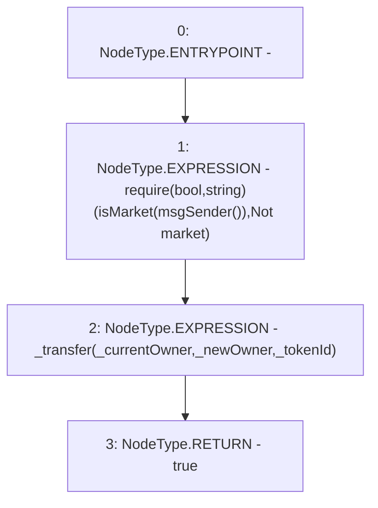

# Context: RCNftHubL2.transferNft

**Contract:** `RCNftHubL2` (Inherits: IRCNftHubL2, NativeMetaTransaction, AccessControl, ERC721URIStorage, ERC721, IERC721Metadata, IERC721, ERC165, IERC165, IAccessControl, Ownable, Context)
**Signature:** `transferNft(address,address,uint256) returns (bool)`
**Method Selector ID:** `0xd11eccd6`
**Visibility:** `external`
**Environment-Free:** `No (reads EVM state context)`
**Modifiers:** None

### State Variables Interaction
- **Reads:** isMarket
- **Writes:** None

### Assertion Checks & Business Requirements
- require/assert: `require(bool,string)(isMarket[msgSender()],Not market)`

### Environment & Verification Flags
- **Uses Foundry Cheatcodes:** No
- **Has Echidna Properties:** No

### Internal Calls Tree
- None

### External Calls / Value Transfers
- None

### Control Flow Graph (CFG)


### Source Mapping
Declared in: `contracts/nfthubs/RCNftHubL2.sol` on lines **101** to **109**

```solidity
    function transferNft(
        address _currentOwner,
        address _newOwner,
        uint256 _tokenId
    ) external override returns (bool) {
        require(isMarket[msgSender()], "Not market");
        _transfer(_currentOwner, _newOwner, _tokenId);
        return true;
    }

```
