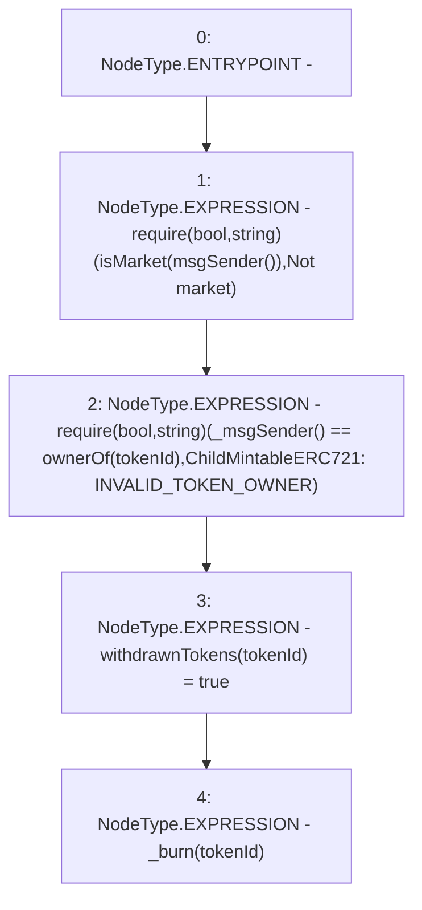

# Context: RCNftHubL2.withdraw

**Contract:** `RCNftHubL2` (Inherits: IRCNftHubL2, NativeMetaTransaction, AccessControl, ERC721URIStorage, ERC721, IERC721Metadata, IERC721, ERC165, IERC165, IAccessControl, Ownable, Context)
**Signature:** `withdraw(uint256)`
**Method Selector ID:** `0x2e1a7d4d`
**Visibility:** `external`
**Environment-Free:** `No (reads EVM state context)`
**Modifiers:** None

### State Variables Interaction
- **Reads:** isMarket
- **Writes:** withdrawnTokens

### Assertion Checks & Business Requirements
- require/assert: `require(bool,string)(isMarket[msgSender()],Not market)`
- require/assert: `require(bool,string)(_msgSender() == ownerOf(tokenId),ChildMintableERC721: INVALID_TOKEN_OWNER)`

### Environment & Verification Flags
- **Uses Foundry Cheatcodes:** No
- **Has Echidna Properties:** No

### Internal Calls Tree
- None

### External Calls / Value Transfers
- None

### Control Flow Graph (CFG)


### Source Mapping
Declared in: `contracts/nfthubs/RCNftHubL2.sol` on lines **157** to **165**

```solidity
    function withdraw(uint256 tokenId) external override {
        require(isMarket[msgSender()], "Not market");
        require(
            _msgSender() == ownerOf(tokenId),
            "ChildMintableERC721: INVALID_TOKEN_OWNER"
        );
        withdrawnTokens[tokenId] = true;
        _burn(tokenId);
    }

```
