# Context: RCOrderbook._newBidInOrderbook

**Contract:** `RCOrderbook` (Inherits: IRCOrderbook, NativeMetaTransaction, Ownable, Context)
**Signature:** `_newBidInOrderbook(address,address,uint256,uint256,uint256,RCOrderbook.Bid)`
**Method Selector ID:** `Internal (No Method ID)`
**Visibility:** `internal`
**Environment-Free:** `No (reads EVM state context)`
**Modifiers:** None

### State Variables Interaction
- **Reads:** index, nonce, ownerOf, treasury, user
- **Writes:** index, nonce, user

### Environment & Verification Flags
- **Uses Foundry Cheatcodes:** No
- **Has Echidna Properties:** No

### Internal Calls Tree
- None

### External Calls / Value Transfers
- `SafeCast.TMP_1343(uint64) = LIBRARY_CALL, dest:SafeCast, function:SafeCast.toUint64(uint256), arguments:['_timeHeldLimit'] `
- `SafeCast.TMP_1342(uint128) = LIBRARY_CALL, dest:SafeCast, function:SafeCast.toUint128(uint256), arguments:['_price'] `
- `SafeCast.TMP_1341(uint64) = LIBRARY_CALL, dest:SafeCast, function:SafeCast.toUint64(uint256), arguments:['_card'] `
- `IRCTreasury.HIGH_LEVEL_CALL, dest:treasury(IRCTreasury), function:updateRentalRate, arguments:['_oldOwner', '_user', 'REF_475', '_price', 'block.timestamp']  `
- `IRCTreasury.HIGH_LEVEL_CALL, dest:treasury(IRCTreasury), function:increaseBidRate, arguments:['_user', '_price']  `

### Control Flow Graph (CFG)

```mermaid
flowchart TD
    Node_0["0: NodeType.ENTRYPOINT - "]
    Node_0 --> Node_1
    Node_1["1: NodeType.IF - ownerOf(_market)(_card) != _market"]
    Node_1 --> Node_2
    Node_1 --> Node_3
    Node_2["2: NodeType.EXPRESSION - (_prevUser,_price) = _searchOrderbook(_prevUser,_market,_card,_price)"]
    Node_2 --> Node_3
    Node_3["3: NodeType.ENDIF - "]
    Node_3 --> Node_4
    Node_4["4: NodeType.VARIABLE - _nextUser = user(_prevUser.next)(index(_prevUser.next)(_market)(_card))"]
    Node_4 --> Node_5
    Node_5["5: NodeType.VARIABLE - "]
    Node_5 --> Node_6
    Node_6["6: NodeType.EXPRESSION - _newBid.market = _market"]
    Node_6 --> Node_7
    Node_7["7: NodeType.EXPRESSION - _newBid.token = SafeCast.toUint64(_card)"]
    Node_7 --> Node_8
    Node_8["8: NodeType.EXPRESSION - _newBid.prev = _nextUser.prev"]
    Node_8 --> Node_9
    Node_9["9: NodeType.EXPRESSION - _newBid.next = _prevUser.next"]
    Node_9 --> Node_10
    Node_10["10: NodeType.EXPRESSION - _newBid.price = SafeCast.toUint128(_price)"]
    Node_10 --> Node_11
    Node_11["11: NodeType.EXPRESSION - _newBid.timeHeldLimit = SafeCast.toUint64(_timeHeldLimit)"]
    Node_11 --> Node_12
    Node_12["12: NodeType.EXPRESSION - _nextUser.prev = _user"]
    Node_12 --> Node_13
    Node_13["13: NodeType.EXPRESSION - _prevUser.next = _user"]
    Node_13 --> Node_14
    Node_14["14: NodeType.EXPRESSION - user(_user).push(_newBid)"]
    Node_14 --> Node_15
    Node_15["15: NodeType.EXPRESSION - index(_user)(_market)(_card) = user(_user).length - (1)"]
    Node_15 --> Node_16
    Node_16["16: NodeType.EXPRESSION - LogAddToOrderbook(_user,_price,_timeHeldLimit,nonce,_card,_market)"]
    Node_16 --> Node_17
    Node_17["17: NodeType.EXPRESSION - nonce ++"]
    Node_17 --> Node_18
    Node_18["18: NodeType.EXPRESSION - treasury.increaseBidRate(_user,_price)"]
    Node_18 --> Node_19
    Node_19["19: NodeType.IF - user(_user)(index(_user)(_market)(_card)).prev == _market"]
    Node_19 --> Node_20
    Node_19 --> Node_23
    Node_20["20: NodeType.VARIABLE - _oldOwner = user(_user)(index(_user)(_market)(_card)).next"]
    Node_20 --> Node_21
    Node_21["21: NodeType.EXPRESSION - transferCard(_market,_card,_oldOwner,_user,_price)"]
    Node_21 --> Node_22
    Node_22["22: NodeType.EXPRESSION - treasury.updateRentalRate(_oldOwner,_user,user(_oldOwner)(index(_oldOwner)(_market)(_card)).price,_price,block.timestamp)"]
    Node_22 --> Node_23
    Node_23["23: NodeType.ENDIF - "]
```


### Source Mapping
Declared in: `contracts/RCOrderbook.sol` on lines **280** to **340**

```solidity
    function _newBidInOrderbook(
        address _user,
        address _market,
        uint256 _card,
        uint256 _price,
        uint256 _timeHeldLimit,
        Bid storage _prevUser
    ) internal {
        if (ownerOf[_market][_card] != _market) {
            (_prevUser, _price) = _searchOrderbook(
                _prevUser,
                _market,
                _card,
                _price
            );
        }

        Bid storage _nextUser =
            user[_prevUser.next][index[_prevUser.next][_market][_card]];

        // create new record
        Bid memory _newBid;
        _newBid.market = _market;
        _newBid.token = SafeCast.toUint64(_card);
        _newBid.prev = _nextUser.prev;
        _newBid.next = _prevUser.next;
        _newBid.price = SafeCast.toUint128(_price);
        _newBid.timeHeldLimit = SafeCast.toUint64(_timeHeldLimit);

        // insert in linked list
        _nextUser.prev = _user; // next record update prev link
        _prevUser.next = _user; // prev record update next link
        user[_user].push(_newBid);

        // update the index to help find the record later
        index[_user][_market][_card] = user[_user].length - (1);

        emit LogAddToOrderbook(
            _user,
            _price,
            _timeHeldLimit,
            nonce,
            _card,
            _market
        );
        nonce++;

        // update treasury values and transfer ownership if required
        treasury.increaseBidRate(_user, _price);
        if (user[_user][index[_user][_market][_card]].prev == _market) {
            address _oldOwner = user[_user][index[_user][_market][_card]].next;
            transferCard(_market, _card, _oldOwner, _user, _price);
            treasury.updateRentalRate(
                _oldOwner,
                _user,
                user[_oldOwner][index[_oldOwner][_market][_card]].price,
                _price,
                block.timestamp
            );
        }
    }

```
