# Context: RCOrderbook._removeBidFromOrderbookIgnoreOwner

**Contract:** `RCOrderbook` (Inherits: IRCOrderbook, NativeMetaTransaction, Ownable, Context)
**Signature:** `_removeBidFromOrderbookIgnoreOwner(address,uint256) returns (uint256)`
**Method Selector ID:** `Internal (No Method ID)`
**Visibility:** `internal`
**Environment-Free:** `No (reads EVM state context)`
**Modifiers:** None

### State Variables Interaction
- **Reads:** index, treasury, user
- **Writes:** index, user

### Environment & Verification Flags
- **Uses Foundry Cheatcodes:** No
- **Has Echidna Properties:** No

### Internal Calls Tree
- None

### External Calls / Value Transfers
- `IRCTreasury.HIGH_LEVEL_CALL, dest:treasury(IRCTreasury), function:decreaseBidRate, arguments:['_user', 'REF_619']  `

### Control Flow Graph (CFG)

```mermaid
flowchart TD
    Node_0["0: NodeType.ENTRYPOINT - "]
    Node_0 --> Node_1
    Node_1["1: NodeType.VARIABLE - _market = msgSender()"]
    Node_1 --> Node_2
    Node_2["2: NodeType.VARIABLE - _currUser = user(_user)(index(_user)(_market)(_card))"]
    Node_2 --> Node_3
    Node_3["3: NodeType.EXPRESSION - treasury.decreaseBidRate(_user,_currUser.price)"]
    Node_3 --> Node_4
    Node_4["4: NodeType.VARIABLE - _tempNext = _currUser.next"]
    Node_4 --> Node_5
    Node_5["5: NodeType.VARIABLE - _tempPrev = _currUser.prev"]
    Node_5 --> Node_6
    Node_6["6: NodeType.EXPRESSION - user(_tempNext)(index(_tempNext)(_market)(_card)).prev = _tempPrev"]
    Node_6 --> Node_7
    Node_7["7: NodeType.EXPRESSION - user(_tempPrev)(index(_tempPrev)(_market)(_card)).next = _tempNext"]
    Node_7 --> Node_8
    Node_8["8: NodeType.EXPRESSION - _newPrice = user(_tempNext)(index(_tempNext)(_market)(_card)).price"]
    Node_8 --> Node_9
    Node_9["9: NodeType.VARIABLE - _index = index(_user)(_market)(_card)"]
    Node_9 --> Node_10
    Node_10["10: NodeType.VARIABLE - _lastRecord = user(_user).length - 1"]
    Node_10 --> Node_11
    Node_11["11: NodeType.IF - _index != _lastRecord"]
    Node_11 --> Node_12
    Node_11 --> Node_13
    Node_12["12: NodeType.EXPRESSION - user(_user)(_index) = user(_user)(_lastRecord)"]
    Node_12 --> Node_13
    Node_13["13: NodeType.ENDIF - "]
    Node_13 --> Node_14
    Node_14["14: NodeType.EXPRESSION - user(_user).pop()"]
    Node_14 --> Node_15
    Node_15["15: NodeType.EXPRESSION - index(_user)(_market)(_card) = 0"]
    Node_15 --> Node_16
    Node_16["16: NodeType.IF - user(_user).length != 0 && _index != _lastRecord"]
    Node_16 --> Node_17
    Node_16 --> Node_18
    Node_17["17: NodeType.EXPRESSION - index(_user)(user(_user)(_index).market)(user(_user)(_index).token) = _index"]
    Node_17 --> Node_18
    Node_18["18: NodeType.ENDIF - "]
    Node_18 --> Node_19
    Node_19["19: NodeType.EXPRESSION - LogRemoveFromOrderbook(_user,_market,_card)"]
    Node_19 --> Node_20
    Node_20["20: NodeType.RETURN - _newPrice"]
```


### Source Mapping
Declared in: `contracts/RCOrderbook.sol` on lines **492** to **527**

```solidity
    function _removeBidFromOrderbookIgnoreOwner(address _user, uint256 _card)
        internal
        returns (uint256 _newPrice)
    {
        address _market = msgSender();
        // update rates
        Bid storage _currUser = user[_user][index[_user][_market][_card]];
        treasury.decreaseBidRate(_user, _currUser.price);

        // extract from linked list
        address _tempNext = _currUser.next;
        address _tempPrev = _currUser.prev;
        user[_tempNext][index[_tempNext][_market][_card]].prev = _tempPrev;
        user[_tempPrev][index[_tempPrev][_market][_card]].next = _tempNext;

        // return next users price to check they're eligable later
        _newPrice = user[_tempNext][index[_tempNext][_market][_card]].price;

        // overwrite array element
        uint256 _index = index[_user][_market][_card];
        uint256 _lastRecord = user[_user].length - 1;
        // no point overwriting itself
        if (_index != _lastRecord) {
            user[_user][_index] = user[_user][_lastRecord];
        }
        user[_user].pop();

        // update the index to help find the record later
        index[_user][_market][_card] = 0;
        if (user[_user].length != 0 && _index != _lastRecord) {
            index[_user][user[_user][_index].market][
                user[_user][_index].token
            ] = _index;
        }
        emit LogRemoveFromOrderbook(_user, _market, _card);
    }

```
