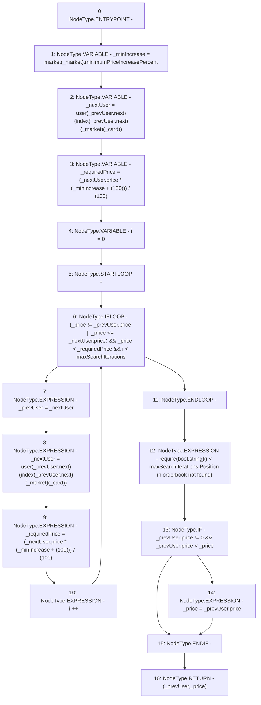

# Context: RCOrderbook._searchOrderbook

**Contract:** `RCOrderbook` (Inherits: IRCOrderbook, NativeMetaTransaction, Ownable, Context)
**Signature:** `_searchOrderbook(RCOrderbook.Bid,address,uint256,uint256) returns (RCOrderbook.Bid, uint256)`
**Method Selector ID:** `Internal (No Method ID)`
**Visibility:** `internal`
**Environment-Free:** `Yes`
**Modifiers:** None

### State Variables Interaction
- **Reads:** index, market, maxSearchIterations, user
- **Writes:** user

### Assertion Checks & Business Requirements
- require/assert: `require(bool,string)(i < maxSearchIterations,Position in orderbook not found)`

### Environment & Verification Flags
- **Uses Foundry Cheatcodes:** No
- **Has Echidna Properties:** No

### Internal Calls Tree
- None

### External Calls / Value Transfers
- None

### Control Flow Graph (CFG)


### Source Mapping
Declared in: `contracts/RCOrderbook.sol` on lines **239** to **277**

```solidity
    function _searchOrderbook(
        Bid storage _prevUser,
        address _market,
        uint256 _card,
        uint256 _price
    ) internal view returns (Bid storage, uint256) {
        uint256 _minIncrease = market[_market].minimumPriceIncreasePercent;
        Bid storage _nextUser =
            user[_prevUser.next][index[_prevUser.next][_market][_card]];
        uint256 _requiredPrice =
            (_nextUser.price * (_minIncrease + (100))) / (100);

        uint256 i = 0;
        while (
            // break loop if match price above AND above price below (so if either is false, continue, hence OR )
            // if match previous then must be greater than next to continue
            (_price != _prevUser.price || _price <= _nextUser.price) &&
            // break loop if price x% above below
            _price < _requiredPrice &&
            // break loop if hits max iterations
            i < maxSearchIterations
        ) {
            _prevUser = _nextUser;
            _nextUser = user[_prevUser.next][
                index[_prevUser.next][_market][_card]
            ];
            _requiredPrice = (_nextUser.price * (_minIncrease + (100))) / (100);
            i++;
        }
        require(i < maxSearchIterations, "Position in orderbook not found");

        // if previous price is zero it must be the market and this is a new owner
        // .. then don't reduce their price, we already checked they are 10% higher
        // .. than the previous owner.
        if (_prevUser.price != 0 && _prevUser.price < _price) {
            _price = _prevUser.price;
        }
        return (_prevUser, _price);
    }

```
