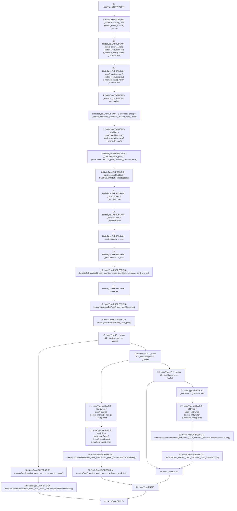

# Context: RCOrderbook._updateBidInOrderbook

**Contract:** `RCOrderbook` (Inherits: IRCOrderbook, NativeMetaTransaction, Ownable, Context)
**Signature:** `_updateBidInOrderbook(address,address,uint256,uint256,uint256,RCOrderbook.Bid)`
**Method Selector ID:** `Internal (No Method ID)`
**Visibility:** `internal`
**Environment-Free:** `No (reads EVM state context)`
**Modifiers:** None

### State Variables Interaction
- **Reads:** index, nonce, treasury, user
- **Writes:** nonce, user

### Environment & Verification Flags
- **Uses Foundry Cheatcodes:** No
- **Has Echidna Properties:** No

### Internal Calls Tree
- None

### External Calls / Value Transfers
- `IRCTreasury.HIGH_LEVEL_CALL, dest:treasury(IRCTreasury), function:updateRentalRate, arguments:['_oldOwner', '_user', '_oldPrice', 'REF_549', 'block.timestamp']  `
- `IRCTreasury.HIGH_LEVEL_CALL, dest:treasury(IRCTreasury), function:updateRentalRate, arguments:['_user', '_newOwner', '_price', '_newPrice', 'block.timestamp']  `
- `IRCTreasury.HIGH_LEVEL_CALL, dest:treasury(IRCTreasury), function:decreaseBidRate, arguments:['_user', '_price']  `
- `IRCTreasury.HIGH_LEVEL_CALL, dest:treasury(IRCTreasury), function:updateRentalRate, arguments:['_user', '_user', '_price', 'REF_525', 'block.timestamp']  `
- `SafeCast.TMP_1355(uint128) = LIBRARY_CALL, dest:SafeCast, function:SafeCast.toUint128(uint256), arguments:['_price'] `
- `SafeCast.TMP_1357(uint64) = LIBRARY_CALL, dest:SafeCast, function:SafeCast.toUint64(uint256), arguments:['_timeHeldLimit'] `
- `IRCTreasury.HIGH_LEVEL_CALL, dest:treasury(IRCTreasury), function:increaseBidRate, arguments:['_user', 'REF_520']  `

### Control Flow Graph (CFG)


### Source Mapping
Declared in: `contracts/RCOrderbook.sol` on lines **343** to **434**

```solidity
    function _updateBidInOrderbook(
        address _user,
        address _market,
        uint256 _card,
        uint256 _price,
        uint256 _timeHeldLimit,
        Bid storage _prevUser
    ) internal {
        // TODO no need to unlink and relink if bid doesn't change position in orderbook
        // unlink current bid
        Bid storage _currUser = user[_user][index[_user][_market][_card]];
        user[_currUser.next][index[_currUser.next][_market][_card]]
            .prev = _currUser.prev;
        user[_currUser.prev][index[_currUser.prev][_market][_card]]
            .next = _currUser.next;
        bool _owner = _currUser.prev == _market;

        // find new position
        (_prevUser, _price) = _searchOrderbook(
            _prevUser,
            _market,
            _card,
            _price
        );
        Bid storage _nextUser =
            user[_prevUser.next][index[_prevUser.next][_market][_card]];

        // update price, save old price for rental rate adjustment later
        (_currUser.price, _price) = (
            SafeCast.toUint128(_price),
            uint256(_currUser.price)
        );
        _currUser.timeHeldLimit = SafeCast.toUint64(_timeHeldLimit);

        // relink bid
        _currUser.next = _prevUser.next;
        _currUser.prev = _nextUser.prev;
        _nextUser.prev = _user; // next record update prev link
        _prevUser.next = _user; // prev record update next link

        emit LogAddToOrderbook(
            _user,
            _currUser.price,
            _timeHeldLimit,
            nonce,
            _card,
            _market
        );
        nonce++;

        // update treasury values and transfer ownership if required
        treasury.increaseBidRate(_user, _currUser.price);
        treasury.decreaseBidRate(_user, _price);
        if (_owner && _currUser.prev == _market) {
            // if owner before and after, update the price difference
            transferCard(_market, _card, _user, _user, _currUser.price);
            treasury.updateRentalRate(
                _user,
                _user,
                _price,
                _currUser.price,
                block.timestamp
            );
        } else if (_owner && _currUser.prev != _market) {
            // if owner before and not after, remove the old price
            address _newOwner =
                user[_market][index[_market][_market][_card]].next;
            uint256 _newPrice =
                user[_newOwner][index[_newOwner][_market][_card]].price;
            treasury.updateRentalRate(
                _user,
                _newOwner,
                _price,
                _newPrice,
                block.timestamp
            );
            transferCard(_market, _card, _user, _newOwner, _newPrice);
        } else if (!_owner && _currUser.prev == _market) {
            // if not owner before but is owner after, add new price
            address _oldOwner = _currUser.next;
            uint256 _oldPrice =
                user[_oldOwner][index[_oldOwner][_market][_card]].price;
            treasury.updateRentalRate(
                _oldOwner,
                _user,
                _oldPrice,
                _currUser.price,
                block.timestamp
            );
            transferCard(_market, _card, _oldOwner, _user, _currUser.price);
        }
    }

```
