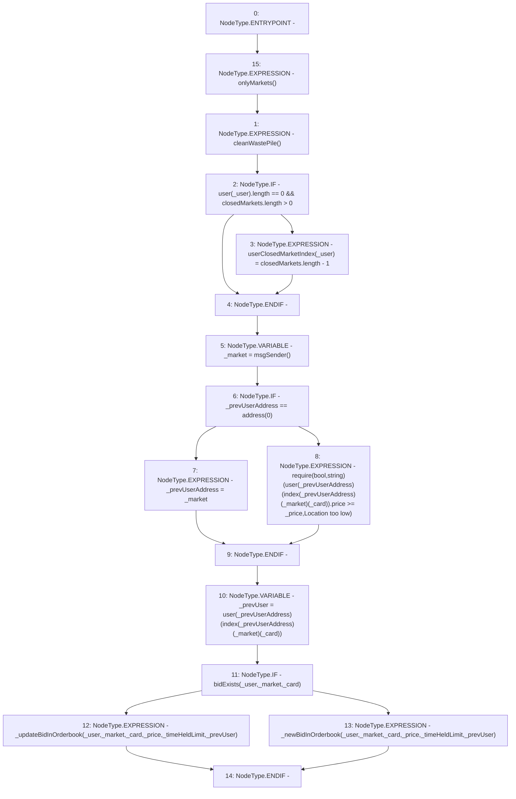

# Context: RCOrderbook.addBidToOrderbook

**Contract:** `RCOrderbook` (Inherits: IRCOrderbook, NativeMetaTransaction, Ownable, Context)
**Signature:** `addBidToOrderbook(address,uint256,uint256,uint256,address)`
**Method Selector ID:** `0xf94fe989`
**Visibility:** `external`
**Environment-Free:** `No (reads EVM state context)`
**Modifiers:**
- `onlyMarkets`
  ```solidity
  modifier onlyMarkets {
          require(isMarket[msgSender()], "Not authorised");
          _;
      }
  ```

### State Variables Interaction
- **Reads:** closedMarkets, index, user
- **Writes:** userClosedMarketIndex

### Assertion Checks & Business Requirements
- require/assert: `require(bool,string)(user[_prevUserAddress][index[_prevUserAddress][_market][_card]].price >= _price,Location too low)`

### Environment & Verification Flags
- **Uses Foundry Cheatcodes:** No
- **Has Echidna Properties:** No

### Internal Calls Tree
- None

### External Calls / Value Transfers
- None

### Control Flow Graph (CFG)


### Source Mapping
Declared in: `contracts/RCOrderbook.sol` on lines **186** to **235**

```solidity
    function addBidToOrderbook(
        address _user,
        uint256 _card,
        uint256 _price,
        uint256 _timeHeldLimit,
        address _prevUserAddress
    ) external override onlyMarkets {
        // each new bid can help clean up some junk
        cleanWastePile();

        if (user[_user].length == 0 && closedMarkets.length > 0) {
            //users first bid, skip already closed markets
            userClosedMarketIndex[_user] = closedMarkets.length - 1;
        }

        address _market = msgSender();
        if (_prevUserAddress == address(0)) {
            _prevUserAddress = _market;
        } else {
            require(
                user[_prevUserAddress][index[_prevUserAddress][_market][_card]]
                    .price >= _price,
                "Location too low"
            );
        }
        Bid storage _prevUser =
            user[_prevUserAddress][index[_prevUserAddress][_market][_card]];

        if (bidExists(_user, _market, _card)) {
            // old bid exists, update it
            _updateBidInOrderbook(
                _user,
                _market,
                _card,
                _price,
                _timeHeldLimit,
                _prevUser
            );
        } else {
            // new bid, add it
            _newBidInOrderbook(
                _user,
                _market,
                _card,
                _price,
                _timeHeldLimit,
                _prevUser
            );
        }
    }

```
