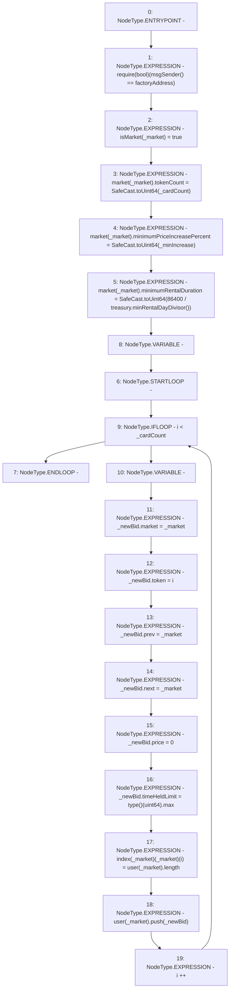

# Context: RCOrderbook.addMarket

**Contract:** `RCOrderbook` (Inherits: IRCOrderbook, NativeMetaTransaction, Ownable, Context)
**Signature:** `addMarket(address,uint256,uint256)`
**Method Selector ID:** `0xc0ffb809`
**Visibility:** `external`
**Environment-Free:** `No (reads EVM state context)`
**Modifiers:** None

### State Variables Interaction
- **Reads:** factoryAddress, market, treasury, user
- **Writes:** index, isMarket, market, user

### Assertion Checks & Business Requirements
- require/assert: `require(bool)(msgSender() == factoryAddress)`

### Environment & Verification Flags
- **Uses Foundry Cheatcodes:** No
- **Has Echidna Properties:** No

### Internal Calls Tree
- None

### External Calls / Value Transfers
- `SafeCast.TMP_1295(uint64) = LIBRARY_CALL, dest:SafeCast, function:SafeCast.toUint64(uint256), arguments:['_cardCount'] `
- `SafeCast.TMP_1299(uint64) = LIBRARY_CALL, dest:SafeCast, function:SafeCast.toUint64(uint256), arguments:['TMP_1298'] `
- `SafeCast.TMP_1296(uint64) = LIBRARY_CALL, dest:SafeCast, function:SafeCast.toUint64(uint256), arguments:['_minIncrease'] `
- `IRCTreasury.TMP_1297(uint256) = HIGH_LEVEL_CALL, dest:treasury(IRCTreasury), function:minRentalDayDivisor, arguments:[]  `

### Control Flow Graph (CFG)


### Source Mapping
Declared in: `contracts/RCOrderbook.sol` on lines **152** to **178**

```solidity
    function addMarket(
        address _market,
        uint256 _cardCount,
        uint256 _minIncrease
    ) external override {
        require(msgSender() == factoryAddress);
        isMarket[_market] = true;
        market[_market].tokenCount = SafeCast.toUint64(_cardCount);
        market[_market].minimumPriceIncreasePercent = SafeCast.toUint64(
            _minIncrease
        );
        market[_market].minimumRentalDuration = SafeCast.toUint64(
            1 days / treasury.minRentalDayDivisor()
        );
        for (uint64 i; i < _cardCount; i++) {
            // create new record for each card that becomes the head&tail of the linked list
            Bid memory _newBid;
            _newBid.market = _market;
            _newBid.token = i;
            _newBid.prev = _market;
            _newBid.next = _market;
            _newBid.price = 0;
            _newBid.timeHeldLimit = type(uint64).max;
            index[_market][_market][i] = user[_market].length;
            user[_market].push(_newBid);
        }
    }

```
