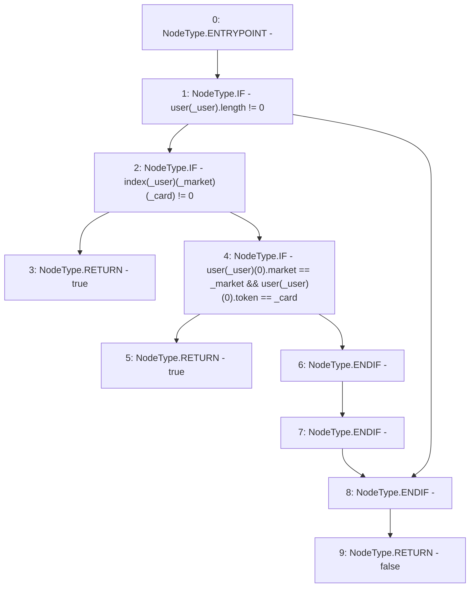

# Context: RCOrderbook.bidExists

**Contract:** `RCOrderbook` (Inherits: IRCOrderbook, NativeMetaTransaction, Ownable, Context)
**Signature:** `bidExists(address,address,uint256) returns (bool)`
**Method Selector ID:** `0x678729eb`
**Visibility:** `public`
**Environment-Free:** `Yes`
**Modifiers:** None

### State Variables Interaction
- **Reads:** index, user
- **Writes:** None

### Environment & Verification Flags
- **Uses Foundry Cheatcodes:** No
- **Has Echidna Properties:** No

### Internal Calls Tree
- None

### External Calls / Value Transfers
- None

### Control Flow Graph (CFG)


### Source Mapping
Declared in: `contracts/RCOrderbook.sol` on lines **770** to **791**

```solidity
    function bidExists(
        address _user,
        address _market,
        uint256 _card
    ) public view override returns (bool) {
        if (user[_user].length != 0) {
            //some bids exist
            if (index[_user][_market][_card] != 0) {
                // this bid exists
                return true;
            } else {
                // check bid isn't index 0
                if (
                    user[_user][0].market == _market &&
                    user[_user][0].token == _card
                ) {
                    return true;
                }
            }
        }
        return false;
    }

```
