# Context: RCOrderbook.cleanWastePile

**Contract:** `RCOrderbook` (Inherits: IRCOrderbook, NativeMetaTransaction, Ownable, Context)
**Signature:** `cleanWastePile()`
**Method Selector ID:** `Internal (No Method ID)`
**Visibility:** `internal`
**Environment-Free:** `Yes`
**Modifiers:** None

### State Variables Interaction
- **Reads:** cleaningLoops, index, user
- **Writes:** index, user

### Environment & Verification Flags
- **Uses Foundry Cheatcodes:** No
- **Has Echidna Properties:** No

### Internal Calls Tree
- None

### External Calls / Value Transfers
- None

### Control Flow Graph (CFG)

```mermaid
flowchart TD
    Node_0["0: NodeType.ENTRYPOINT - "]
    Node_0 --> Node_1
    Node_1["1: NodeType.VARIABLE - "]
    Node_1 --> Node_2
    Node_2["2: NodeType.STARTLOOP - "]
    Node_2 --> Node_3
    Node_3["3: NodeType.IFLOOP - i < cleaningLoops && user(address(this)).length > 0"]
    Node_3 --> Node_4
    Node_3 --> Node_27
    Node_4["4: NodeType.VARIABLE - _pileHeight = user(address(this)).length - 1"]
    Node_4 --> Node_5
    Node_5["5: NodeType.IF - user(address(this))(_pileHeight).next == address(this)"]
    Node_5 --> Node_6
    Node_5 --> Node_7
    Node_6["6: NodeType.EXPRESSION - user(address(this)).pop()"]
    Node_6 --> Node_25
    Node_7["7: NodeType.VARIABLE - _market = user(address(this))(_pileHeight).market"]
    Node_7 --> Node_8
    Node_8["8: NodeType.VARIABLE - _card = user(address(this))(_pileHeight).token"]
    Node_8 --> Node_9
    Node_9["9: NodeType.VARIABLE - _user = user(address(this))(index(address(this))(_market)(_card)).next"]
    Node_9 --> Node_10
    Node_10["10: NodeType.VARIABLE - _currUser = user(_user)(index(_user)(_market)(_card))"]
    Node_10 --> Node_11
    Node_11["11: NodeType.VARIABLE - _tempNext = _currUser.next"]
    Node_11 --> Node_12
    Node_12["12: NodeType.VARIABLE - _tempPrev = _currUser.prev"]
    Node_12 --> Node_13
    Node_13["13: NodeType.EXPRESSION - user(_tempNext)(index(_tempNext)(_market)(_card)).prev = _tempPrev"]
    Node_13 --> Node_14
    Node_14["14: NodeType.EXPRESSION - user(_tempPrev)(index(_tempPrev)(_market)(_card)).next = _tempNext"]
    Node_14 --> Node_15
    Node_15["15: NodeType.VARIABLE - _index = index(_user)(_market)(_card)"]
    Node_15 --> Node_16
    Node_16["16: NodeType.VARIABLE - _lastRecord = user(_user).length - (1)"]
    Node_16 --> Node_17
    Node_17["17: NodeType.IF - _index != _lastRecord"]
    Node_17 --> Node_18
    Node_17 --> Node_19
    Node_18["18: NodeType.EXPRESSION - user(_user)(_index) = user(_user)(_lastRecord)"]
    Node_18 --> Node_19
    Node_19["19: NodeType.ENDIF - "]
    Node_19 --> Node_20
    Node_20["20: NodeType.EXPRESSION - user(_user).pop()"]
    Node_20 --> Node_21
    Node_21["21: NodeType.EXPRESSION - index(_user)(_market)(_card) = 0"]
    Node_21 --> Node_22
    Node_22["22: NodeType.IF - user(_user).length != 0 && _index != _lastRecord"]
    Node_22 --> Node_23
    Node_22 --> Node_24
    Node_23["23: NodeType.EXPRESSION - index(_user)(user(_user)(_index).market)(user(_user)(_index).token) = _index"]
    Node_23 --> Node_24
    Node_24["24: NodeType.ENDIF - "]
    Node_24 --> Node_25
    Node_25["25: NodeType.ENDIF - "]
    Node_25 --> Node_26
    Node_26["26: NodeType.EXPRESSION - i ++"]
    Node_26 --> Node_3
    Node_27["27: NodeType.ENDLOOP - "]
```


### Source Mapping
Declared in: `contracts/RCOrderbook.sol` on lines **716** to **759**

```solidity
    function cleanWastePile() internal {
        uint256 i;
        while (i < cleaningLoops && user[address(this)].length > 0) {
            uint256 _pileHeight = user[address(this)].length - 1;

            if (user[address(this)][_pileHeight].next == address(this)) {
                user[address(this)].pop();
            } else {
                address _market = user[address(this)][_pileHeight].market;
                uint256 _card = user[address(this)][_pileHeight].token;
                address _user =
                    user[address(this)][index[address(this)][_market][_card]]
                        .next;

                Bid storage _currUser =
                    user[_user][index[_user][_market][_card]];
                // extract from linked list
                address _tempNext = _currUser.next;
                address _tempPrev = _currUser.prev;
                user[_tempNext][index[_tempNext][_market][_card]]
                    .prev = _tempPrev;
                user[_tempPrev][index[_tempPrev][_market][_card]]
                    .next = _tempNext;

                // overwrite array element
                uint256 _index = index[_user][_market][_card];
                uint256 _lastRecord = user[_user].length - (1);
                // no point overwriting itself
                if (_index != _lastRecord) {
                    user[_user][_index] = user[_user][_lastRecord];
                }
                user[_user].pop();

                // update the index to help find the record later
                index[_user][_market][_card] = 0;
                if (user[_user].length != 0 && _index != _lastRecord) {
                    index[_user][user[_user][_index].market][
                        user[_user][_index].token
                    ] = _index;
                }
            }
            i++;
        }
    }

```
