# Context: RCOrderbook.closeMarket

**Contract:** `RCOrderbook` (Inherits: IRCOrderbook, NativeMetaTransaction, Ownable, Context)
**Signature:** `closeMarket()`
**Method Selector ID:** `0xc511ed5e`
**Visibility:** `external`
**Environment-Free:** `No (reads EVM state context)`
**Modifiers:**
- `onlyMarkets`
  ```solidity
  modifier onlyMarkets {
          require(isMarket[msgSender()], "Not authorised");
          _;
      }
  ```

### State Variables Interaction
- **Reads:** closedMarkets, index, market, treasury, user
- **Writes:** closedMarkets, user

### Environment & Verification Flags
- **Uses Foundry Cheatcodes:** No
- **Has Echidna Properties:** No

### Internal Calls Tree
- None

### External Calls / Value Transfers
- `IRCTreasury.HIGH_LEVEL_CALL, dest:treasury(IRCTreasury), function:updateRentalRate, arguments:['_owner', '_market', '_price', '0', 'block.timestamp']  `

### Control Flow Graph (CFG)

```mermaid
flowchart TD
    Node_0["0: NodeType.ENTRYPOINT - "]
    Node_0 --> Node_25
    Node_1["1: NodeType.VARIABLE - _market = msgSender()"]
    Node_1 --> Node_2
    Node_2["2: NodeType.EXPRESSION - closedMarkets.push(_market)"]
    Node_2 --> Node_5
    Node_3["3: NodeType.STARTLOOP - "]
    Node_3 --> Node_6
    Node_4["4: NodeType.ENDLOOP - "]
    Node_5["5: NodeType.VARIABLE - i = 0"]
    Node_5 --> Node_3
    Node_6["6: NodeType.IFLOOP - i < market(_market).tokenCount"]
    Node_6 --> Node_7
    Node_6 --> Node_4
    Node_7["7: NodeType.VARIABLE - _owner = user(_market)(index(_market)(_market)(i)).next"]
    Node_7 --> Node_8
    Node_8["8: NodeType.VARIABLE - _price = user(_owner)(index(_owner)(_market)(i)).price"]
    Node_8 --> Node_9
    Node_9["9: NodeType.EXPRESSION - treasury.updateRentalRate(_owner,_market,_price,0,block.timestamp)"]
    Node_9 --> Node_10
    Node_10["10: NodeType.VARIABLE - _firstBid = _owner"]
    Node_10 --> Node_11
    Node_11["11: NodeType.VARIABLE - _lastBid = user(_market)(index(_market)(_market)(i)).prev"]
    Node_11 --> Node_12
    Node_12["12: NodeType.EXPRESSION - user(_market)(index(_market)(_market)(i)).prev = _market"]
    Node_12 --> Node_13
    Node_13["13: NodeType.EXPRESSION - user(_market)(index(_market)(_market)(i)).next = _market"]
    Node_13 --> Node_14
    Node_14["14: NodeType.EXPRESSION - user(_firstBid)(index(_market)(_firstBid)(i)).prev = address(this)"]
    Node_14 --> Node_15
    Node_15["15: NodeType.EXPRESSION - user(_lastBid)(index(_market)(_lastBid)(i)).next = address(this)"]
    Node_15 --> Node_16
    Node_16["16: NodeType.VARIABLE - "]
    Node_16 --> Node_17
    Node_17["17: NodeType.EXPRESSION - _newBid.market = _market"]
    Node_17 --> Node_18
    Node_18["18: NodeType.EXPRESSION - _newBid.token = i"]
    Node_18 --> Node_19
    Node_19["19: NodeType.EXPRESSION - _newBid.prev = _lastBid"]
    Node_19 --> Node_20
    Node_20["20: NodeType.EXPRESSION - _newBid.next = _firstBid"]
    Node_20 --> Node_21
    Node_21["21: NodeType.EXPRESSION - _newBid.price = 0"]
    Node_21 --> Node_22
    Node_22["22: NodeType.EXPRESSION - _newBid.timeHeldLimit = 0"]
    Node_22 --> Node_23
    Node_23["23: NodeType.EXPRESSION - user(address(this)).push(_newBid)"]
    Node_23 --> Node_24
    Node_24["24: NodeType.EXPRESSION - i ++"]
    Node_24 --> Node_6
    Node_25["25: NodeType.EXPRESSION - onlyMarkets()"]
    Node_25 --> Node_1
```


### Source Mapping
Declared in: `contracts/RCOrderbook.sol` on lines **633** to **669**

```solidity
    function closeMarket() external override onlyMarkets {
        address _market = msgSender();
        closedMarkets.push(_market);

        for (uint64 i = 0; i < market[_market].tokenCount; i++) {
            // reduce owners rental rate
            address _owner = user[_market][index[_market][_market][i]].next;
            uint256 _price = user[_owner][index[_owner][_market][i]].price;
            treasury.updateRentalRate(
                _owner,
                _market,
                _price,
                0,
                block.timestamp
            );

            // store first and last bids for later
            address _firstBid = _owner;
            address _lastBid = user[_market][index[_market][_market][i]].prev;

            // detach market from rest of list
            user[_market][index[_market][_market][i]].prev = _market;
            user[_market][index[_market][_market][i]].next = _market;
            user[_firstBid][index[_market][_firstBid][i]].prev = address(this);
            user[_lastBid][index[_market][_lastBid][i]].next = address(this);

            // insert bids in the waste pile
            Bid memory _newBid;
            _newBid.market = _market;
            _newBid.token = i;
            _newBid.prev = _lastBid;
            _newBid.next = _firstBid;
            _newBid.price = 0;
            _newBid.timeHeldLimit = 0;
            user[address(this)].push(_newBid);
        }
    }

```
