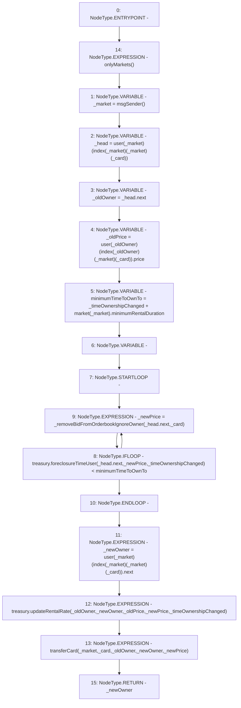

# Context: RCOrderbook.findNewOwner

**Contract:** `RCOrderbook` (Inherits: IRCOrderbook, NativeMetaTransaction, Ownable, Context)
**Signature:** `findNewOwner(uint256,uint256) returns (address)`
**Method Selector ID:** `0xfefa6119`
**Visibility:** `external`
**Environment-Free:** `No (reads EVM state context)`
**Modifiers:**
- `onlyMarkets`
  ```solidity
  modifier onlyMarkets {
          require(isMarket[msgSender()], "Not authorised");
          _;
      }
  ```

### State Variables Interaction
- **Reads:** index, market, treasury, user
- **Writes:** None

### Environment & Verification Flags
- **Uses Foundry Cheatcodes:** No
- **Has Echidna Properties:** No

### Internal Calls Tree
- None

### External Calls / Value Transfers
- `IRCTreasury.TMP_1401(uint256) = HIGH_LEVEL_CALL, dest:treasury(IRCTreasury), function:foreclosureTimeUser, arguments:['REF_683', '_newPrice', '_timeOwnershipChanged']  `
- `IRCTreasury.HIGH_LEVEL_CALL, dest:treasury(IRCTreasury), function:updateRentalRate, arguments:['_oldOwner', '_newOwner', '_oldPrice', '_newPrice', '_timeOwnershipChanged']  `

### Control Flow Graph (CFG)


### Source Mapping
Declared in: `contracts/RCOrderbook.sol` on lines **532** to **570**

```solidity
    function findNewOwner(uint256 _card, uint256 _timeOwnershipChanged)
        external
        override
        onlyMarkets
        returns (address _newOwner)
    {
        address _market = msgSender();
        // the market is the head of the list, the next bid is therefore the owner
        Bid storage _head = user[_market][index[_market][_market][_card]];
        address _oldOwner = _head.next;
        uint256 _oldPrice =
            user[_oldOwner][index[_oldOwner][_market][_card]].price;
        uint256 minimumTimeToOwnTo =
            _timeOwnershipChanged + market[_market].minimumRentalDuration;
        uint256 _newPrice;

        // delete current owner
        do {
            _newPrice = _removeBidFromOrderbookIgnoreOwner(_head.next, _card);
            // delete next bid if foreclosed
        } while (
            treasury.foreclosureTimeUser(
                _head.next,
                _newPrice,
                _timeOwnershipChanged
            ) < minimumTimeToOwnTo
        );

        // the old owner is dead, long live the new owner
        _newOwner = user[_market][index[_market][_market][_card]].next;
        treasury.updateRentalRate(
            _oldOwner,
            _newOwner,
            _oldPrice,
            _newPrice,
            _timeOwnershipChanged
        );
        transferCard(_market, _card, _oldOwner, _newOwner, _newPrice);
    }

```
