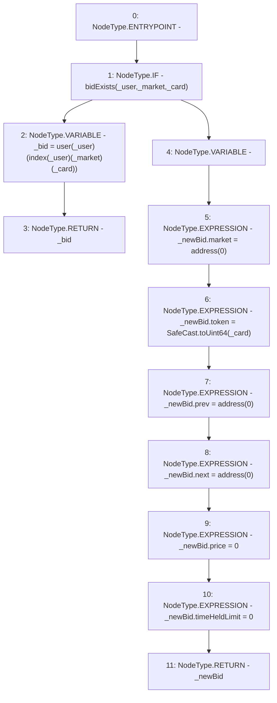

# Context: RCOrderbook.getBid

**Contract:** `RCOrderbook` (Inherits: IRCOrderbook, NativeMetaTransaction, Ownable, Context)
**Signature:** `getBid(address,address,uint256) returns (RCOrderbook.Bid)`
**Method Selector ID:** `0x46cb40e5`
**Visibility:** `external`
**Environment-Free:** `Yes`
**Modifiers:** None

### State Variables Interaction
- **Reads:** index, user
- **Writes:** None

### Environment & Verification Flags
- **Uses Foundry Cheatcodes:** No
- **Has Echidna Properties:** No

### Internal Calls Tree
- None

### External Calls / Value Transfers
- `SafeCast.TMP_1482(uint64) = LIBRARY_CALL, dest:SafeCast, function:SafeCast.toUint64(uint256), arguments:['_card'] `

### Control Flow Graph (CFG)


### Source Mapping
Declared in: `contracts/RCOrderbook.sol` on lines **809** to **827**

```solidity
    function getBid(
        address _market,
        address _user,
        uint256 _card
    ) external view returns (Bid memory) {
        if (bidExists(_user, _market, _card)) {
            Bid memory _bid = user[_user][index[_user][_market][_card]];
            return _bid;
        } else {
            Bid memory _newBid;
            _newBid.market = address(0);
            _newBid.token = SafeCast.toUint64(_card);
            _newBid.prev = address(0);
            _newBid.next = address(0);
            _newBid.price = 0;
            _newBid.timeHeldLimit = 0;
            return _newBid;
        }
    }

```
