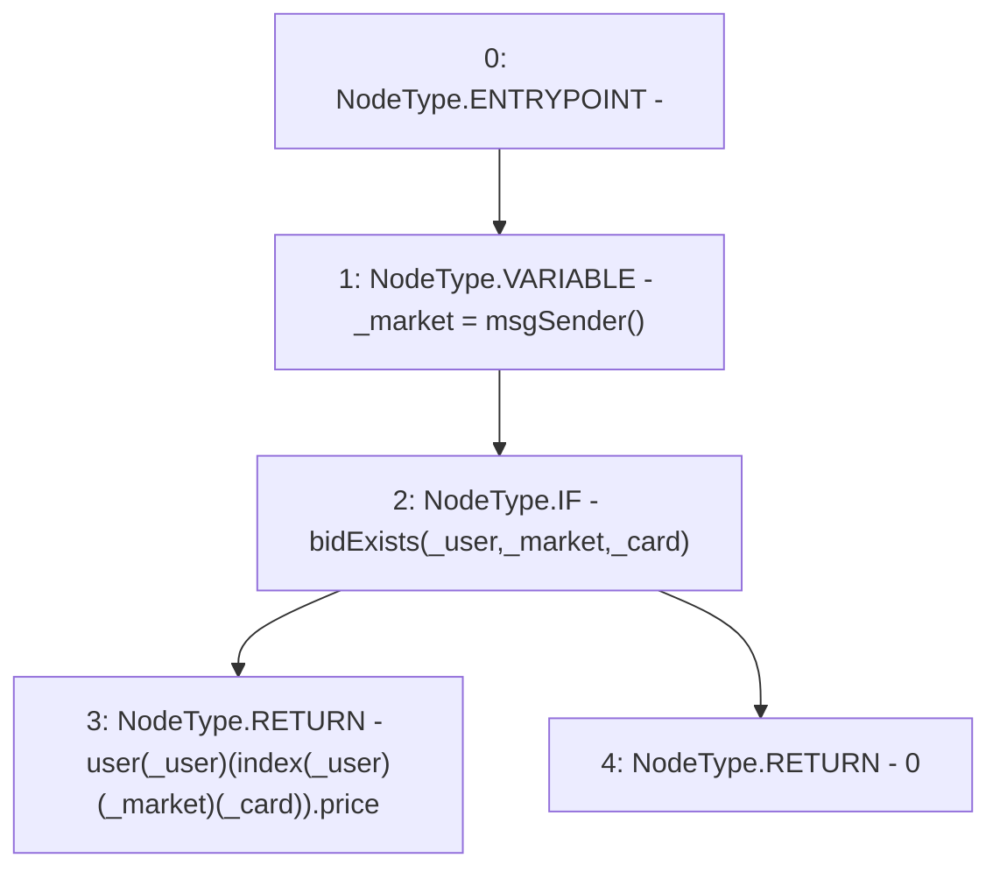

# Context: RCOrderbook.getBidValue

**Contract:** `RCOrderbook` (Inherits: IRCOrderbook, NativeMetaTransaction, Ownable, Context)
**Signature:** `getBidValue(address,uint256) returns (uint256)`
**Method Selector ID:** `0x9344dc04`
**Visibility:** `external`
**Environment-Free:** `No (reads EVM state context)`
**Modifiers:** None

### State Variables Interaction
- **Reads:** index, user
- **Writes:** None

### Environment & Verification Flags
- **Uses Foundry Cheatcodes:** No
- **Has Echidna Properties:** No

### Internal Calls Tree
- None

### External Calls / Value Transfers
- None

### Control Flow Graph (CFG)


### Source Mapping
Declared in: `contracts/RCOrderbook.sol` on lines **793** to **805**

```solidity
    function getBidValue(address _user, uint256 _card)
        external
        view
        override
        returns (uint256)
    {
        address _market = msgSender();
        if (bidExists(_user, _market, _card)) {
            return user[_user][index[_user][_market][_card]].price;
        } else {
            return 0;
        }
    }

```
