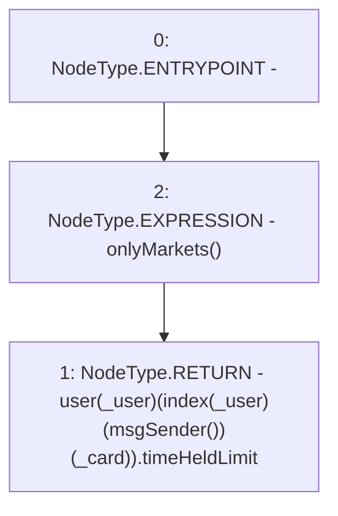

# Context: RCOrderbook.getTimeHeldlimit

**Contract:** `RCOrderbook` (Inherits: IRCOrderbook, NativeMetaTransaction, Ownable, Context)
**Signature:** `getTimeHeldlimit(address,uint256) returns (uint256)`
**Method Selector ID:** `0x61be6baf`
**Visibility:** `external`
**Environment-Free:** `No (reads EVM state context)`
**Modifiers:**
- `onlyMarkets`
  ```solidity
  modifier onlyMarkets {
          require(isMarket[msgSender()], "Not authorised");
          _;
      }
  ```

### State Variables Interaction
- **Reads:** index, user
- **Writes:** None

### Environment & Verification Flags
- **Uses Foundry Cheatcodes:** No
- **Has Echidna Properties:** No

### Internal Calls Tree
- None

### External Calls / Value Transfers
- None

### Control Flow Graph (CFG)


### Source Mapping
Declared in: `contracts/RCOrderbook.sol` on lines **829** to **837**

```solidity
    function getTimeHeldlimit(address _user, uint256 _card)
        external
        view
        override
        onlyMarkets
        returns (uint256)
    {
        return user[_user][index[_user][msgSender()][_card]].timeHeldLimit;
    }

```
