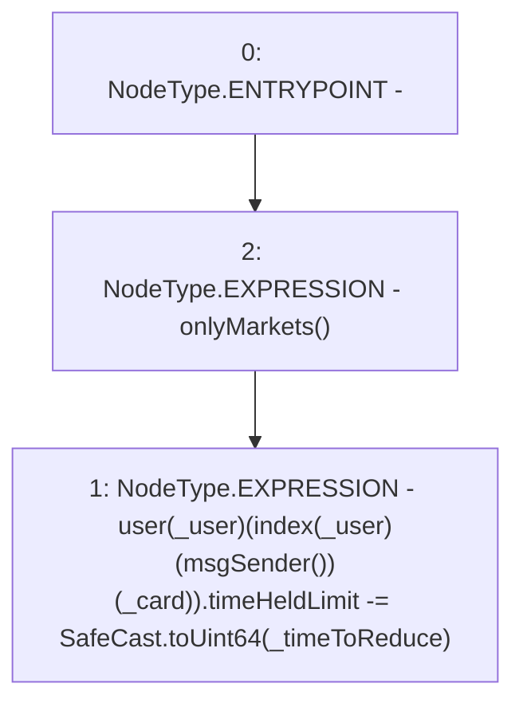

# Context: RCOrderbook.reduceTimeHeldLimit

**Contract:** `RCOrderbook` (Inherits: IRCOrderbook, NativeMetaTransaction, Ownable, Context)
**Signature:** `reduceTimeHeldLimit(address,uint256,uint256)`
**Method Selector ID:** `0xa471a437`
**Visibility:** `external`
**Environment-Free:** `No (reads EVM state context)`
**Modifiers:**
- `onlyMarkets`
  ```solidity
  modifier onlyMarkets {
          require(isMarket[msgSender()], "Not authorised");
          _;
      }
  ```

### State Variables Interaction
- **Reads:** index, user
- **Writes:** user

### Environment & Verification Flags
- **Uses Foundry Cheatcodes:** No
- **Has Echidna Properties:** No

### Internal Calls Tree
- None

### External Calls / Value Transfers
- `SafeCast.TMP_1493(uint64) = LIBRARY_CALL, dest:SafeCast, function:SafeCast.toUint64(uint256), arguments:['_timeToReduce'] `

### Control Flow Graph (CFG)


### Source Mapping
Declared in: `contracts/RCOrderbook.sol` on lines **850** to **857**

```solidity
    function reduceTimeHeldLimit(
        address _user,
        uint256 _card,
        uint256 _timeToReduce
    ) external override onlyMarkets {
        user[_user][index[_user][msgSender()][_card]].timeHeldLimit -= SafeCast
            .toUint64(_timeToReduce);
    }

```
