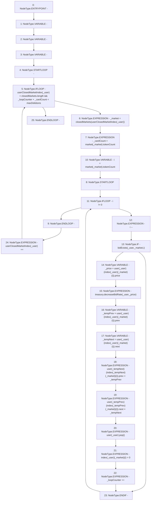

# Context: RCOrderbook.removeOldBids

**Contract:** `RCOrderbook` (Inherits: IRCOrderbook, NativeMetaTransaction, Ownable, Context)
**Signature:** `removeOldBids(address)`
**Method Selector ID:** `0xbeb724c9`
**Visibility:** `external`
**Environment-Free:** `Yes`
**Modifiers:** None

### State Variables Interaction
- **Reads:** closedMarkets, index, market, maxDeletions, treasury, user, userClosedMarketIndex
- **Writes:** index, user, userClosedMarketIndex

### Environment & Verification Flags
- **Uses Foundry Cheatcodes:** No
- **Has Echidna Properties:** No

### Internal Calls Tree
- None

### External Calls / Value Transfers
- `IRCTreasury.HIGH_LEVEL_CALL, dest:treasury(IRCTreasury), function:decreaseBidRate, arguments:['_user', '_price']  `

### Control Flow Graph (CFG)


### Source Mapping
Declared in: `contracts/RCOrderbook.sol` on lines **674** to **713**

```solidity
    function removeOldBids(address _user) external override {
        address _market;
        uint256 _cardCount;
        uint256 _loopCounter;
        while (
            userClosedMarketIndex[_user] < closedMarkets.length &&
            _loopCounter + _cardCount < maxDeletions
        ) {
            _market = closedMarkets[userClosedMarketIndex[_user]];
            _cardCount = market[_market].tokenCount;
            for (uint256 i = market[_market].tokenCount; i != 0; ) {
                i--;
                if (bidExists(_user, _market, i)) {
                    // reduce bidRate
                    uint256 _price =
                        user[_user][index[_user][_market][i]].price;
                    treasury.decreaseBidRate(_user, _price);

                    // preserve linked list
                    address _tempPrev =
                        user[_user][index[_user][_market][i]].prev;
                    address _tempNext =
                        user[_user][index[_user][_market][i]].next;

                    user[_tempNext][index[_tempNext][_market][i]]
                        .prev = _tempPrev;
                    user[_tempPrev][index[_tempPrev][_market][i]]
                        .next = _tempNext;

                    // delete bid
                    user[_user].pop();
                    index[_user][_market][i] = 0;

                    // count deletions
                    _loopCounter++;
                }
            }
            userClosedMarketIndex[_user]++;
        }
    }

```
