# Context: RCOrderbook.removeUserFromOrderbook

**Contract:** `RCOrderbook` (Inherits: IRCOrderbook, NativeMetaTransaction, Ownable, Context)
**Signature:** `removeUserFromOrderbook(address) returns (bool)`
**Method Selector ID:** `0xfaf9b886`
**Visibility:** `external`
**Environment-Free:** `No (reads EVM state context)`
**Modifiers:** None

### State Variables Interaction
- **Reads:** index, maxDeletions, treasury, user
- **Writes:** index, user

### Assertion Checks & Business Requirements
- require/assert: `require(bool,string)(treasury.isForeclosed(_user),User must be foreclosed)`

### Environment & Verification Flags
- **Uses Foundry Cheatcodes:** No
- **Has Echidna Properties:** No

### Internal Calls Tree
- None

### External Calls / Value Transfers
- `IRCTreasury.HIGH_LEVEL_CALL, dest:treasury(IRCTreasury), function:decreaseBidRate, arguments:['_user', 'REF_740']  `
- `IRCTreasury.TMP_1407(bool) = HIGH_LEVEL_CALL, dest:treasury(IRCTreasury), function:isForeclosed, arguments:['_user']  `
- `IRCTreasury.HIGH_LEVEL_CALL, dest:treasury(IRCTreasury), function:resetUser, arguments:['_user']  `
- `IRCTreasury.HIGH_LEVEL_CALL, dest:treasury(IRCTreasury), function:updateRentalRate, arguments:['_user', '_tempNext', 'REF_736', '_price', 'block.timestamp']  `

### Control Flow Graph (CFG)

```mermaid
flowchart TD
    Node_0["0: NodeType.ENTRYPOINT - "]
    Node_0 --> Node_1
    Node_1["1: NodeType.EXPRESSION - require(bool,string)(treasury.isForeclosed(_user),User must be foreclosed)"]
    Node_1 --> Node_2
    Node_2["2: NodeType.VARIABLE - i = user(_user).length"]
    Node_2 --> Node_3
    Node_3["3: NodeType.VARIABLE - _limit = 0"]
    Node_3 --> Node_4
    Node_4["4: NodeType.IF - i > maxDeletions"]
    Node_4 --> Node_5
    Node_4 --> Node_6
    Node_5["5: NodeType.EXPRESSION - _limit = i - maxDeletions"]
    Node_5 --> Node_6
    Node_6["6: NodeType.ENDIF - "]
    Node_6 --> Node_7
    Node_7["7: NodeType.VARIABLE - _market = user(_user)(i - 1).market"]
    Node_7 --> Node_8
    Node_8["8: NodeType.VARIABLE - _card = user(_user)(i - 1).token"]
    Node_8 --> Node_9
    Node_9["9: NodeType.STARTLOOP - "]
    Node_9 --> Node_11
    Node_10["10: NodeType.IFLOOP - user(_user).length > _limit"]
    Node_10 --> Node_11
    Node_10 --> Node_26
    Node_11["11: NodeType.EXPRESSION - i --"]
    Node_11 --> Node_12
    Node_12["12: NodeType.EXPRESSION - index(_user)(user(_user)(i).market)(user(_user)(i).token) = 0"]
    Node_12 --> Node_13
    Node_13["13: NodeType.VARIABLE - _tempPrev = user(_user)(i).prev"]
    Node_13 --> Node_14
    Node_14["14: NodeType.VARIABLE - _tempNext = user(_user)(i).next"]
    Node_14 --> Node_15
    Node_15["15: NodeType.IF - _tempPrev == user(_user)(i).market"]
    Node_15 --> Node_16
    Node_15 --> Node_21
    Node_16["16: NodeType.EXPRESSION - _market = user(_user)(i).market"]
    Node_16 --> Node_17
    Node_17["17: NodeType.EXPRESSION - _card = user(_user)(i).token"]
    Node_17 --> Node_18
    Node_18["18: NodeType.VARIABLE - _price = user(_tempNext)(index(_tempNext)(_market)(_card)).price"]
    Node_18 --> Node_19
    Node_19["19: NodeType.EXPRESSION - treasury.updateRentalRate(_user,_tempNext,user(_user)(i).price,_price,block.timestamp)"]
    Node_19 --> Node_20
    Node_20["20: NodeType.EXPRESSION - transferCard(_market,_card,_user,_tempNext,_price)"]
    Node_20 --> Node_21
    Node_21["21: NodeType.ENDIF - "]
    Node_21 --> Node_22
    Node_22["22: NodeType.EXPRESSION - treasury.decreaseBidRate(_user,user(_user)(i).price)"]
    Node_22 --> Node_23
    Node_23["23: NodeType.EXPRESSION - user(_tempNext)(index(_tempNext)(user(_user)(i).market)(user(_user)(i).token)).prev = _tempPrev"]
    Node_23 --> Node_24
    Node_24["24: NodeType.EXPRESSION - user(_tempPrev)(index(_tempPrev)(user(_user)(i).market)(user(_user)(i).token)).next = _tempNext"]
    Node_24 --> Node_25
    Node_25["25: NodeType.EXPRESSION - user(_user).pop()"]
    Node_25 --> Node_10
    Node_26["26: NodeType.ENDLOOP - "]
    Node_26 --> Node_27
    Node_27["27: NodeType.IF - user(_user).length == 0"]
    Node_27 --> Node_28
    Node_27 --> Node_30
    Node_28["28: NodeType.EXPRESSION - treasury.resetUser(_user)"]
    Node_28 --> Node_29
    Node_29["29: NodeType.EXPRESSION - _userForeclosed = false"]
    Node_29 --> Node_31
    Node_30["30: NodeType.EXPRESSION - _userForeclosed = true"]
    Node_30 --> Node_31
    Node_31["31: NodeType.ENDIF - "]
    Node_31 --> Node_32
    Node_32["32: NodeType.RETURN - _userForeclosed"]
```


### Source Mapping
Declared in: `contracts/RCOrderbook.sol` on lines **575** to **629**

```solidity
    function removeUserFromOrderbook(address _user)
        external
        override
        returns (bool _userForeclosed)
    {
        require(treasury.isForeclosed(_user), "User must be foreclosed");
        uint256 i = user[_user].length;
        uint256 _limit = 0;
        if (i > maxDeletions) {
            _limit = i - maxDeletions;
        }
        address _market = user[_user][i - 1].market;
        uint256 _card = user[_user][i - 1].token;

        do {
            i--;
            index[_user][user[_user][i].market][user[_user][i].token] = 0;
            address _tempPrev = user[_user][i].prev;
            address _tempNext = user[_user][i].next;

            // reduce the rentalRate if they are owner
            if (_tempPrev == user[_user][i].market) {
                _market = user[_user][i].market;
                _card = user[_user][i].token;
                uint256 _price =
                    user[_tempNext][index[_tempNext][_market][_card]].price;
                treasury.updateRentalRate(
                    _user,
                    _tempNext,
                    user[_user][i].price,
                    _price,
                    block.timestamp
                );
                transferCard(_market, _card, _user, _tempNext, _price);
            }

            treasury.decreaseBidRate(_user, user[_user][i].price);

            user[_tempNext][
                index[_tempNext][user[_user][i].market][user[_user][i].token]
            ]
                .prev = _tempPrev;
            user[_tempPrev][
                index[_tempPrev][user[_user][i].market][user[_user][i].token]
            ]
                .next = _tempNext;
            user[_user].pop();
        } while (user[_user].length > _limit);
        if (user[_user].length == 0) {
            treasury.resetUser(_user);
            _userForeclosed = false;
        } else {
            _userForeclosed = true;
        }
    }

```
