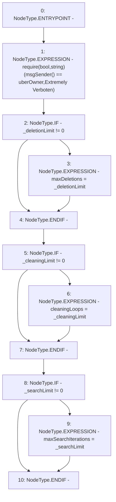

# Context: RCOrderbook.setLimits

**Contract:** `RCOrderbook` (Inherits: IRCOrderbook, NativeMetaTransaction, Ownable, Context)
**Signature:** `setLimits(uint256,uint256,uint256)`
**Method Selector ID:** `0x189ae5f2`
**Visibility:** `external`
**Environment-Free:** `No (reads EVM state context)`
**Modifiers:** None

### State Variables Interaction
- **Reads:** uberOwner
- **Writes:** cleaningLoops, maxDeletions, maxSearchIterations

### Assertion Checks & Business Requirements
- require/assert: `require(bool,string)(msgSender() == uberOwner,Extremely Verboten)`

### Environment & Verification Flags
- **Uses Foundry Cheatcodes:** No
- **Has Echidna Properties:** No

### Internal Calls Tree
- None

### External Calls / Value Transfers
- None

### Control Flow Graph (CFG)


### Source Mapping
Declared in: `contracts/RCOrderbook.sol` on lines **129** to **144**

```solidity
    function setLimits(
        uint256 _deletionLimit,
        uint256 _cleaningLimit,
        uint256 _searchLimit
    ) external override {
        require(msgSender() == uberOwner, "Extremely Verboten");
        if (_deletionLimit != 0) {
            maxDeletions = _deletionLimit;
        }
        if (_cleaningLimit != 0) {
            cleaningLoops = _cleaningLimit;
        }
        if (_searchLimit != 0) {
            maxSearchIterations = _searchLimit;
        }
    }

```
