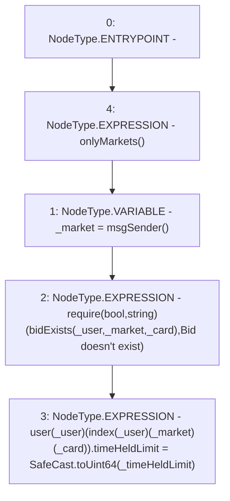

# Context: RCOrderbook.setTimeHeldlimit

**Contract:** `RCOrderbook` (Inherits: IRCOrderbook, NativeMetaTransaction, Ownable, Context)
**Signature:** `setTimeHeldlimit(address,uint256,uint256)`
**Method Selector ID:** `0x9c935d17`
**Visibility:** `external`
**Environment-Free:** `No (reads EVM state context)`
**Modifiers:**
- `onlyMarkets`
  ```solidity
  modifier onlyMarkets {
          require(isMarket[msgSender()], "Not authorised");
          _;
      }
  ```

### State Variables Interaction
- **Reads:** index, user
- **Writes:** user

### Assertion Checks & Business Requirements
- require/assert: `require(bool,string)(bidExists(_user,_market,_card),Bid doesn't exist)`

### Environment & Verification Flags
- **Uses Foundry Cheatcodes:** No
- **Has Echidna Properties:** No

### Internal Calls Tree
- None

### External Calls / Value Transfers
- `SafeCast.TMP_1490(uint64) = LIBRARY_CALL, dest:SafeCast, function:SafeCast.toUint64(uint256), arguments:['_timeHeldLimit'] `

### Control Flow Graph (CFG)


### Source Mapping
Declared in: `contracts/RCOrderbook.sol` on lines **839** to **848**

```solidity
    function setTimeHeldlimit(
        address _user,
        uint256 _card,
        uint256 _timeHeldLimit
    ) external override onlyMarkets {
        address _market = msgSender();
        require(bidExists(_user, _market, _card), "Bid doesn't exist");
        user[_user][index[_user][_market][_card]].timeHeldLimit = SafeCast
            .toUint64(_timeHeldLimit);
    }

```
