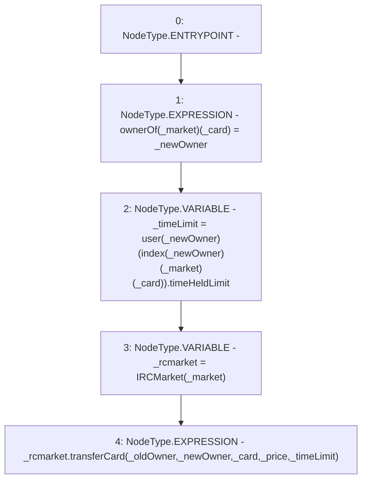

# Context: RCOrderbook.transferCard

**Contract:** `RCOrderbook` (Inherits: IRCOrderbook, NativeMetaTransaction, Ownable, Context)
**Signature:** `transferCard(address,uint256,address,address,uint256)`
**Method Selector ID:** `Internal (No Method ID)`
**Visibility:** `internal`
**Environment-Free:** `Yes`
**Modifiers:** None

### State Variables Interaction
- **Reads:** index, user
- **Writes:** ownerOf

### Environment & Verification Flags
- **Uses Foundry Cheatcodes:** No
- **Has Echidna Properties:** No

### Internal Calls Tree
- None

### External Calls / Value Transfers
- `IRCMarket.HIGH_LEVEL_CALL, dest:_rcmarket(IRCMarket), function:transferCard, arguments:['_oldOwner', '_newOwner', '_card', '_price', '_timeLimit']  `

### Control Flow Graph (CFG)


### Source Mapping
Declared in: `contracts/RCOrderbook.sol` on lines **859** to **871**

```solidity
    function transferCard(
        address _market,
        uint256 _card,
        address _oldOwner,
        address _newOwner,
        uint256 _price
    ) internal {
        ownerOf[_market][_card] = _newOwner;
        uint256 _timeLimit =
            user[_newOwner][index[_newOwner][_market][_card]].timeHeldLimit;
        IRCMarket _rcmarket = IRCMarket(_market);
        _rcmarket.transferCard(_oldOwner, _newOwner, _card, _price, _timeLimit);
    }

```
