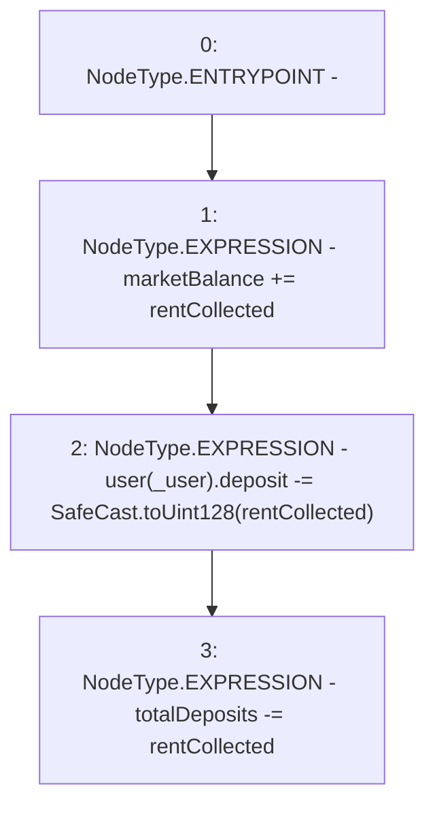

# Context: RCTreasury._increaseMarketBalance

**Contract:** `RCTreasury` (Inherits: IRCTreasury, NativeMetaTransaction, Ownable, Context)
**Signature:** `_increaseMarketBalance(uint256,address)`
**Method Selector ID:** `Internal (No Method ID)`
**Visibility:** `internal`
**Environment-Free:** `Yes`
**Modifiers:** None

### State Variables Interaction
- **Reads:** marketBalance, totalDeposits, user
- **Writes:** marketBalance, totalDeposits, user

### Environment & Verification Flags
- **Uses Foundry Cheatcodes:** No
- **Has Echidna Properties:** No

### Internal Calls Tree
- None

### External Calls / Value Transfers
- `SafeCast.TMP_1757(uint128) = LIBRARY_CALL, dest:SafeCast, function:SafeCast.toUint128(uint256), arguments:['rentCollected'] `

### Control Flow Graph (CFG)


### Source Mapping
Declared in: `contracts/RCTreasury.sol` on lines **748** to **754**

```solidity
    function _increaseMarketBalance(uint256 rentCollected, address _user)
        internal
    {
        marketBalance += rentCollected;
        user[_user].deposit -= SafeCast.toUint128(rentCollected);
        totalDeposits -= rentCollected;
    }

```
