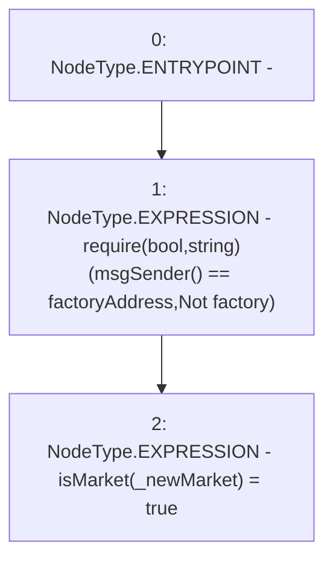

# Context: RCTreasury.addMarket

**Contract:** `RCTreasury` (Inherits: IRCTreasury, NativeMetaTransaction, Ownable, Context)
**Signature:** `addMarket(address)`
**Method Selector ID:** `0x93e30633`
**Visibility:** `external`
**Environment-Free:** `No (reads EVM state context)`
**Modifiers:** None

### State Variables Interaction
- **Reads:** factoryAddress
- **Writes:** isMarket

### Assertion Checks & Business Requirements
- require/assert: `require(bool,string)(msgSender() == factoryAddress,Not factory)`

### Environment & Verification Flags
- **Uses Foundry Cheatcodes:** No
- **Has Echidna Properties:** No

### Internal Calls Tree
- None

### External Calls / Value Transfers
- None

### Control Flow Graph (CFG)


### Source Mapping
Declared in: `contracts/RCTreasury.sol` on lines **151** to **154**

```solidity
    function addMarket(address _newMarket) external override {
        require(msgSender() == factoryAddress, "Not factory");
        isMarket[_newMarket] = true;
    }

```
