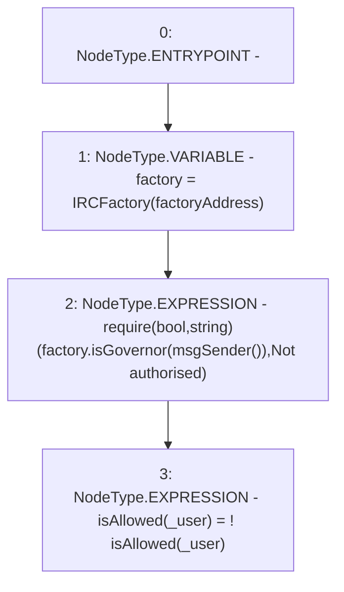

# Context: RCTreasury.addToWhitelist

**Contract:** `RCTreasury` (Inherits: IRCTreasury, NativeMetaTransaction, Ownable, Context)
**Signature:** `addToWhitelist(address)`
**Method Selector ID:** `0xe43252d7`
**Visibility:** `public`
**Environment-Free:** `No (reads EVM state context)`
**Modifiers:** None

### State Variables Interaction
- **Reads:** factoryAddress, isAllowed
- **Writes:** isAllowed

### Assertion Checks & Business Requirements
- require/assert: `require(bool,string)(factory.isGovernor(msgSender()),Not authorised)`

### Environment & Verification Flags
- **Uses Foundry Cheatcodes:** No
- **Has Echidna Properties:** No

### Internal Calls Tree
- None

### External Calls / Value Transfers
- `IRCFactory.TMP_1537(bool) = HIGH_LEVEL_CALL, dest:factory(IRCFactory), function:isGovernor, arguments:['TMP_1536']  `

### Control Flow Graph (CFG)


### Source Mapping
Declared in: `contracts/RCTreasury.sol` on lines **210** to **214**

```solidity
    function addToWhitelist(address _user) public override {
        IRCFactory factory = IRCFactory(factoryAddress);
        require(factory.isGovernor(msgSender()), "Not authorised");
        isAllowed[_user] = !isAllowed[_user];
    }

```
