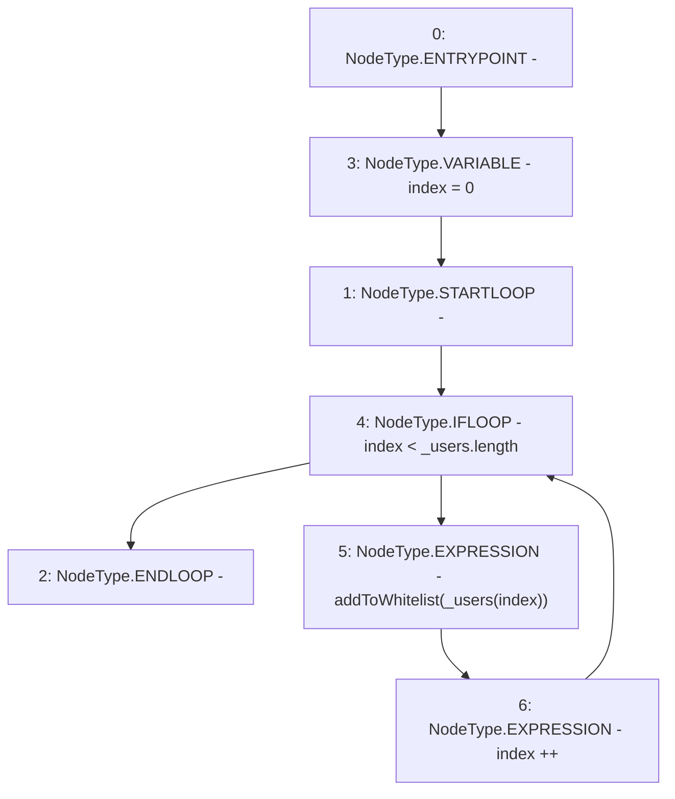

# Context: RCTreasury.batchAddToWhitelist

**Contract:** `RCTreasury` (Inherits: IRCTreasury, NativeMetaTransaction, Ownable, Context)
**Signature:** `batchAddToWhitelist(address[])`
**Method Selector ID:** `0x2db6fa36`
**Visibility:** `public`
**Environment-Free:** `No (reads EVM state context)`
**Modifiers:** None

### State Variables Interaction
- **Reads:** None
- **Writes:** None

### Environment & Verification Flags
- **Uses Foundry Cheatcodes:** No
- **Has Echidna Properties:** No

### Internal Calls Tree
- None

### External Calls / Value Transfers
- None

### Control Flow Graph (CFG)


### Source Mapping
Declared in: `contracts/RCTreasury.sol` on lines **217** to **221**

```solidity
    function batchAddToWhitelist(address[] calldata _users) public override {
        for (uint256 index = 0; index < _users.length; index++) {
            addToWhitelist(_users[index]);
        }
    }

```
