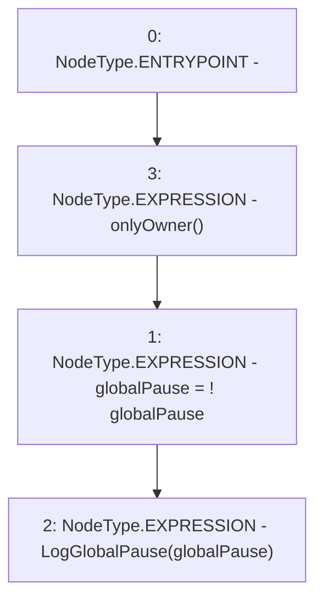

# Context: RCTreasury.changeGlobalPause

**Contract:** `RCTreasury` (Inherits: IRCTreasury, NativeMetaTransaction, Ownable, Context)
**Signature:** `changeGlobalPause()`
**Method Selector ID:** `0x1f8864e6`
**Visibility:** `external`
**Environment-Free:** `No (reads EVM state context)`
**Modifiers:**
- `onlyOwner`
  ```solidity
  modifier onlyOwner() {
          require(owner() == _msgSender(), "Ownable: caller is not the owner");
          _;
      }
  ```

### State Variables Interaction
- **Reads:** globalPause
- **Writes:** globalPause

### Environment & Verification Flags
- **Uses Foundry Cheatcodes:** No
- **Has Echidna Properties:** No

### Internal Calls Tree
- None

### External Calls / Value Transfers
- None

### Control Flow Graph (CFG)


### Source Mapping
Declared in: `contracts/RCTreasury.sol` on lines **188** to **191**

```solidity
    function changeGlobalPause() external override onlyOwner {
        globalPause = !globalPause;
        emit LogGlobalPause(globalPause);
    }

```
