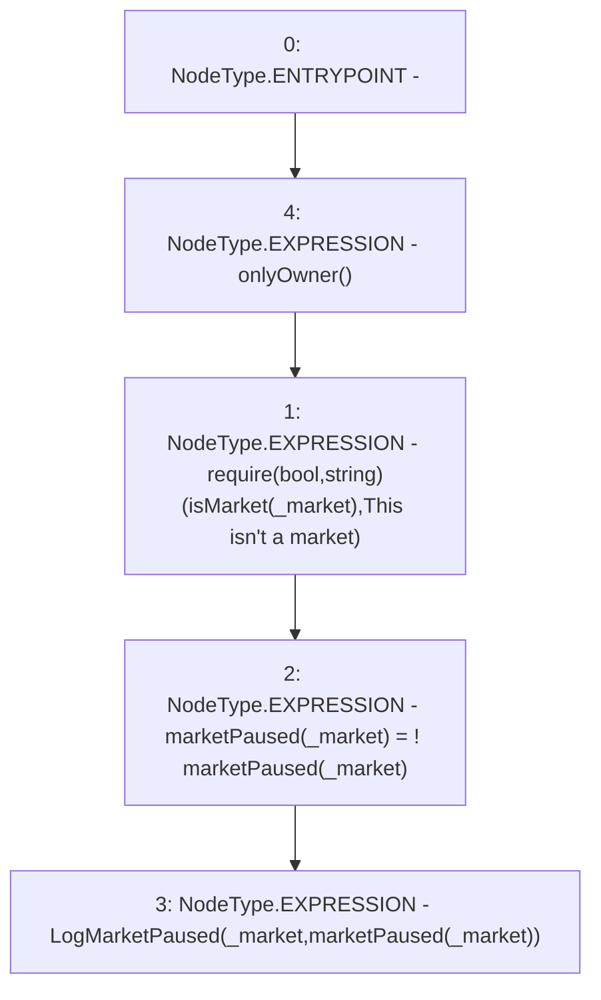

# Context: RCTreasury.changePauseMarket

**Contract:** `RCTreasury` (Inherits: IRCTreasury, NativeMetaTransaction, Ownable, Context)
**Signature:** `changePauseMarket(address)`
**Method Selector ID:** `0x843a19ac`
**Visibility:** `external`
**Environment-Free:** `No (reads EVM state context)`
**Modifiers:**
- `onlyOwner`
  ```solidity
  modifier onlyOwner() {
          require(owner() == _msgSender(), "Ownable: caller is not the owner");
          _;
      }
  ```

### State Variables Interaction
- **Reads:** isMarket, marketPaused
- **Writes:** marketPaused

### Assertion Checks & Business Requirements
- require/assert: `require(bool,string)(isMarket[_market],This isn't a market)`

### Environment & Verification Flags
- **Uses Foundry Cheatcodes:** No
- **Has Echidna Properties:** No

### Internal Calls Tree
- None

### External Calls / Value Transfers
- None

### Control Flow Graph (CFG)


### Source Mapping
Declared in: `contracts/RCTreasury.sol` on lines **194** to **198**

```solidity
    function changePauseMarket(address _market) external override onlyOwner {
        require(isMarket[_market], "This isn't a market");
        marketPaused[_market] = !marketPaused[_market];
        emit LogMarketPaused(_market, marketPaused[_market]);
    }

```
