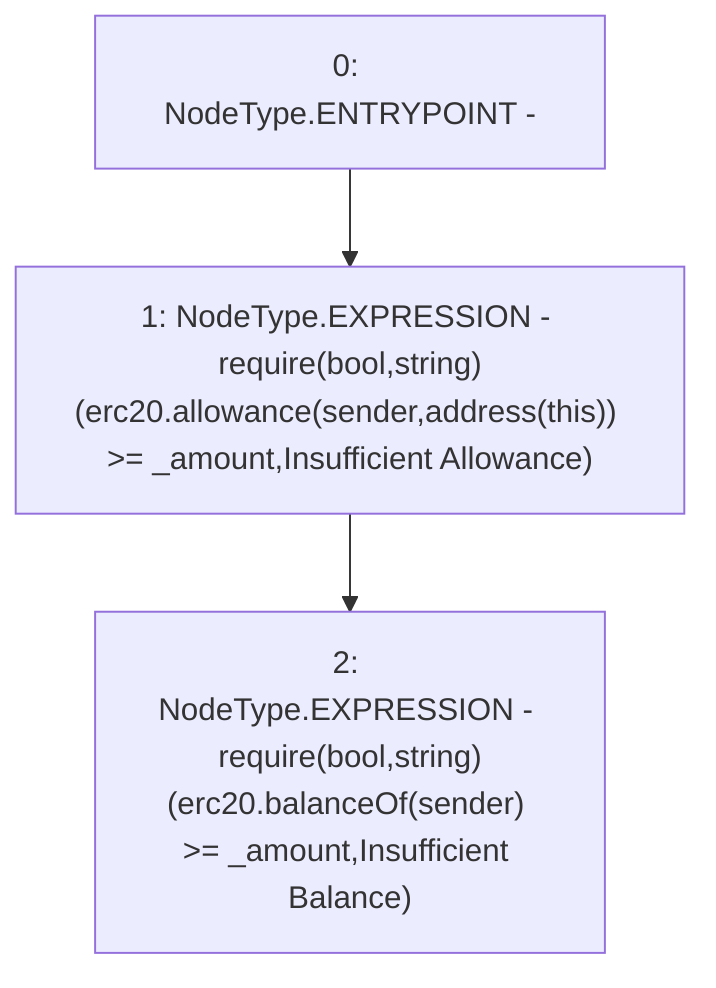

# Context: RCTreasury.checkSponsorship

**Contract:** `RCTreasury` (Inherits: IRCTreasury, NativeMetaTransaction, Ownable, Context)
**Signature:** `checkSponsorship(address,uint256)`
**Method Selector ID:** `0x9c402b23`
**Visibility:** `external`
**Environment-Free:** `Yes`
**Modifiers:** None

### State Variables Interaction
- **Reads:** erc20
- **Writes:** None

### Assertion Checks & Business Requirements
- require/assert: `require(bool,string)(erc20.allowance(sender,address(this)) >= _amount,Insufficient Allowance)`
- require/assert: `require(bool,string)(erc20.balanceOf(sender) >= _amount,Insufficient Balance)`

### Environment & Verification Flags
- **Uses Foundry Cheatcodes:** No
- **Has Echidna Properties:** No

### Internal Calls Tree
- None

### External Calls / Value Transfers
- `IERC20.TMP_1646(uint256) = HIGH_LEVEL_CALL, dest:erc20(IERC20), function:balanceOf, arguments:['sender']  `
- `IERC20.TMP_1643(uint256) = HIGH_LEVEL_CALL, dest:erc20(IERC20), function:allowance, arguments:['sender', 'TMP_1642']  `

### Control Flow Graph (CFG)


### Source Mapping
Declared in: `contracts/RCTreasury.sol` on lines **386** to **396**

```solidity
    function checkSponsorship(address sender, uint256 _amount)
        external
        view
        override
    {
        require(
            erc20.allowance(sender, address(this)) >= _amount,
            "Insufficient Allowance"
        );
        require(erc20.balanceOf(sender) >= _amount, "Insufficient Balance");
    }

```
