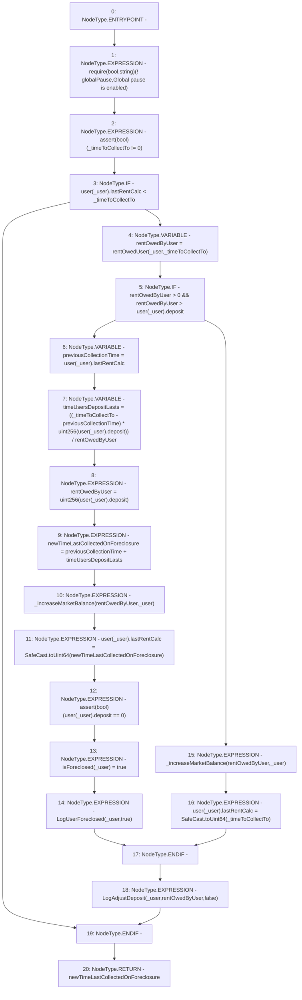

# Context: RCTreasury.collectRentUser

**Contract:** `RCTreasury` (Inherits: IRCTreasury, NativeMetaTransaction, Ownable, Context)
**Signature:** `collectRentUser(address,uint256) returns (uint256)`
**Method Selector ID:** `0xa4a5734f`
**Visibility:** `public`
**Environment-Free:** `Yes`
**Modifiers:** None

### State Variables Interaction
- **Reads:** globalPause, user
- **Writes:** isForeclosed, user

### Assertion Checks & Business Requirements
- require/assert: `require(bool,string)(! globalPause,Global pause is enabled)`
- require/assert: `assert(bool)(_timeToCollectTo != 0)`
- require/assert: `assert(bool)(user[_user].deposit == 0)`

### Environment & Verification Flags
- **Uses Foundry Cheatcodes:** No
- **Has Echidna Properties:** No

### Internal Calls Tree
- None

### External Calls / Value Transfers
- `SafeCast.TMP_1750(uint64) = LIBRARY_CALL, dest:SafeCast, function:SafeCast.toUint64(uint256), arguments:['newTimeLastCollectedOnForeclosure'] `
- `SafeCast.TMP_1755(uint64) = LIBRARY_CALL, dest:SafeCast, function:SafeCast.toUint64(uint256), arguments:['_timeToCollectTo'] `

### Control Flow Graph (CFG)


### Source Mapping
Declared in: `contracts/RCTreasury.sol` on lines **703** to **745**

```solidity
    function collectRentUser(address _user, uint256 _timeToCollectTo)
        public
        override
        returns (uint256 newTimeLastCollectedOnForeclosure)
    {
        require(!globalPause, "Global pause is enabled");
        assert(_timeToCollectTo != 0);
        if (user[_user].lastRentCalc < _timeToCollectTo) {
            uint256 rentOwedByUser = rentOwedUser(_user, _timeToCollectTo);

            if (rentOwedByUser > 0 && rentOwedByUser > user[_user].deposit) {
                // The User has run out of deposit already.
                uint256 previousCollectionTime = user[_user].lastRentCalc;

                /*
            timeTheirDepsitLasted = timeSinceLastUpdate * (usersDeposit/rentOwed)
                                  = (now - previousCollectionTime) * (usersDeposit/rentOwed)
            */
                uint256 timeUsersDepositLasts =
                    ((_timeToCollectTo - previousCollectionTime) *
                        uint256(user[_user].deposit)) / rentOwedByUser;
                /*
            Users last collection time = previousCollectionTime + timeTheirDepsitLasted
            */
                rentOwedByUser = uint256(user[_user].deposit);
                newTimeLastCollectedOnForeclosure =
                    previousCollectionTime +
                    timeUsersDepositLasts;
                _increaseMarketBalance(rentOwedByUser, _user);
                user[_user].lastRentCalc = SafeCast.toUint64(
                    newTimeLastCollectedOnForeclosure
                );
                assert(user[_user].deposit == 0);
                isForeclosed[_user] = true;
                emit LogUserForeclosed(_user, true);
            } else {
                // User has enough deposit to pay rent.
                _increaseMarketBalance(rentOwedByUser, _user);
                user[_user].lastRentCalc = SafeCast.toUint64(_timeToCollectTo);
            }
            emit LogAdjustDeposit(_user, rentOwedByUser, false);
        }
    }

```
