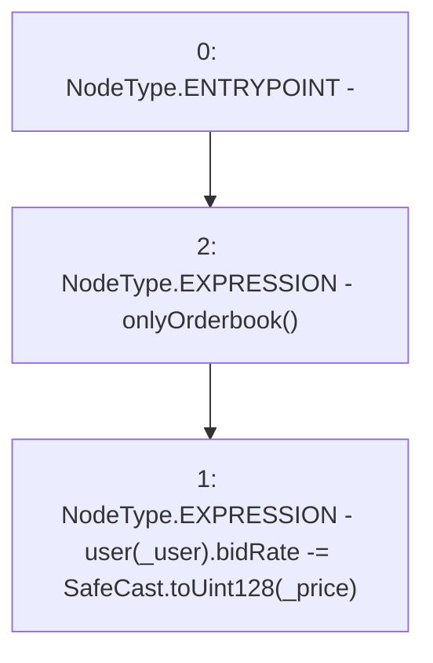

# Context: RCTreasury.decreaseBidRate

**Contract:** `RCTreasury` (Inherits: IRCTreasury, NativeMetaTransaction, Ownable, Context)
**Signature:** `decreaseBidRate(address,uint256)`
**Method Selector ID:** `0xfd2a97fd`
**Visibility:** `external`
**Environment-Free:** `No (reads EVM state context)`
**Modifiers:**
- `onlyOrderbook`
  ```solidity
  modifier onlyOrderbook {
          require(msgSender() == address(orderbook), "Not authorised");
          _;
      }
  ```

### State Variables Interaction
- **Reads:** user
- **Writes:** user

### Environment & Verification Flags
- **Uses Foundry Cheatcodes:** No
- **Has Echidna Properties:** No

### Internal Calls Tree
- None

### External Calls / Value Transfers
- `SafeCast.TMP_1705(uint128) = LIBRARY_CALL, dest:SafeCast, function:SafeCast.toUint128(uint256), arguments:['_price'] `

### Control Flow Graph (CFG)


### Source Mapping
Declared in: `contracts/RCTreasury.sol` on lines **591** to **597**

```solidity
    function decreaseBidRate(address _user, uint256 _price)
        external
        override
        onlyOrderbook
    {
        user[_user].bidRate -= SafeCast.toUint128(_price);
    }

```
