# Context: RCTreasury.deposit

**Contract:** `RCTreasury` (Inherits: IRCTreasury, NativeMetaTransaction, Ownable, Context)
**Signature:** `deposit(uint256,address) returns (bool)`
**Method Selector ID:** `0x6e553f65`
**Visibility:** `public`
**Environment-Free:** `No (reads EVM state context)`
**Modifiers:**
- `balancedBooks`
  ```solidity
  modifier balancedBooks {
          _;
          // using >= not == in case anyone sends tokens direct to contract
          require(
              erc20.balanceOf(address(this)) >=
                  totalDeposits + marketBalance + totalMarketPots,
              "Books are unbalanced!"
          );
      }
  ```

### State Variables Interaction
- **Reads:** erc20, globalPause, isAllowed, maxContractBalance, minRentalDayDivisor, orderbook, totalDeposits, user, whitelistEnabled
- **Writes:** isForeclosed, totalDeposits, user

### Assertion Checks & Business Requirements
- require/assert: `require(bool,string)(! globalPause,Deposits are disabled)`
- require/assert: `require(bool,string)(erc20.allowance(msgSender(),address(this)) >= _amount,User not approved to send this amount)`
- require/assert: `require(bool,string)((erc20.balanceOf(address(this)) + _amount) <= maxContractBalance,Limit hit)`
- require/assert: `require(bool,string)(_amount > 0,Must deposit something)`
- require/assert: `require(bool,string)(isAllowed[msgSender()],Not in whitelist)`

### Environment & Verification Flags
- **Uses Foundry Cheatcodes:** No
- **Has Echidna Properties:** No

### Internal Calls Tree
- None

### External Calls / Value Transfers
- `IERC20.TMP_1589(uint256) = HIGH_LEVEL_CALL, dest:erc20(IERC20), function:allowance, arguments:['TMP_1587', 'TMP_1588']  `
- `IERC20.TMP_1603(bool) = HIGH_LEVEL_CALL, dest:erc20(IERC20), function:transferFrom, arguments:['TMP_1601', 'TMP_1602', '_amount']  `
- `IERC20.TMP_1593(uint256) = HIGH_LEVEL_CALL, dest:erc20(IERC20), function:balanceOf, arguments:['TMP_1592']  `
- `SafeCast.TMP_1605(uint128) = LIBRARY_CALL, dest:SafeCast, function:SafeCast.toUint128(uint256), arguments:['_amount'] `
- `IRCOrderbook.HIGH_LEVEL_CALL, dest:orderbook(IRCOrderbook), function:removeOldBids, arguments:['_user']  `
- `TMP_1591(None) = SOLIDITY_CALL require(bool,string)(TMP_1590,User not approved to send this amount)`

### Control Flow Graph (CFG)

```mermaid
flowchart TD
    Node_0["0: NodeType.ENTRYPOINT - "]
    Node_0 --> Node_18
    Node_1["1: NodeType.EXPRESSION - require(bool,string)(! globalPause,Deposits are disabled)"]
    Node_1 --> Node_2
    Node_2["2: NodeType.EXPRESSION - require(bool,string)(erc20.allowance(msgSender(),address(this)) >= _amount,User not approved to send this amount)"]
    Node_2 --> Node_3
    Node_3["3: NodeType.EXPRESSION - require(bool,string)((erc20.balanceOf(address(this)) + _amount) <= maxContractBalance,Limit hit)"]
    Node_3 --> Node_4
    Node_4["4: NodeType.EXPRESSION - require(bool,string)(_amount > 0,Must deposit something)"]
    Node_4 --> Node_5
    Node_5["5: NodeType.IF - whitelistEnabled"]
    Node_5 --> Node_6
    Node_5 --> Node_7
    Node_6["6: NodeType.EXPRESSION - require(bool,string)(isAllowed(msgSender()),Not in whitelist)"]
    Node_6 --> Node_7
    Node_7["7: NodeType.ENDIF - "]
    Node_7 --> Node_8
    Node_8["8: NodeType.EXPRESSION - erc20.transferFrom(msgSender(),address(this),_amount)"]
    Node_8 --> Node_9
    Node_9["9: NodeType.EXPRESSION - orderbook.removeOldBids(_user)"]
    Node_9 --> Node_10
    Node_10["10: NodeType.EXPRESSION - user(_user).deposit += SafeCast.toUint128(_amount)"]
    Node_10 --> Node_11
    Node_11["11: NodeType.EXPRESSION - totalDeposits += _amount"]
    Node_11 --> Node_12
    Node_12["12: NodeType.EXPRESSION - LogAdjustDeposit(_user,_amount,true)"]
    Node_12 --> Node_13
    Node_13["13: NodeType.IF - (user(_user).deposit + _amount) > (user(_user).bidRate / minRentalDayDivisor)"]
    Node_13 --> Node_14
    Node_13 --> Node_16
    Node_14["14: NodeType.EXPRESSION - isForeclosed(_user) = false"]
    Node_14 --> Node_15
    Node_15["15: NodeType.EXPRESSION - LogUserForeclosed(_user,false)"]
    Node_15 --> Node_16
    Node_16["16: NodeType.ENDIF - "]
    Node_16 --> Node_17
    Node_17["17: NodeType.RETURN - true"]
    Node_18["18: NodeType.EXPRESSION - balancedBooks()"]
    Node_18 --> Node_1
```


### Source Mapping
Declared in: `contracts/RCTreasury.sol` on lines **279** to **316**

```solidity
    function deposit(uint256 _amount, address _user)
        public
        override
        balancedBooks
        returns (bool)
    {
        require(!globalPause, "Deposits are disabled");
        require(
            erc20.allowance(msgSender(), address(this)) >= _amount,
            "User not approved to send this amount"
        );
        require(
            (erc20.balanceOf(address(this)) + _amount) <= maxContractBalance,
            "Limit hit"
        );
        require(_amount > 0, "Must deposit something");
        if (whitelistEnabled) {
            require(isAllowed[msgSender()], "Not in whitelist");
        }
        erc20.transferFrom(msgSender(), address(this), _amount);

        // do some cleaning up, it might help cancel their foreclosure
        orderbook.removeOldBids(_user);

        user[_user].deposit += SafeCast.toUint128(_amount);
        totalDeposits += _amount;
        emit LogAdjustDeposit(_user, _amount, true);

        // this deposit could cancel the users foreclosure
        if (
            (user[_user].deposit + _amount) >
            (user[_user].bidRate / minRentalDayDivisor)
        ) {
            isForeclosed[_user] = false;
            emit LogUserForeclosed(_user, false);
        }
        return true;
    }

```
