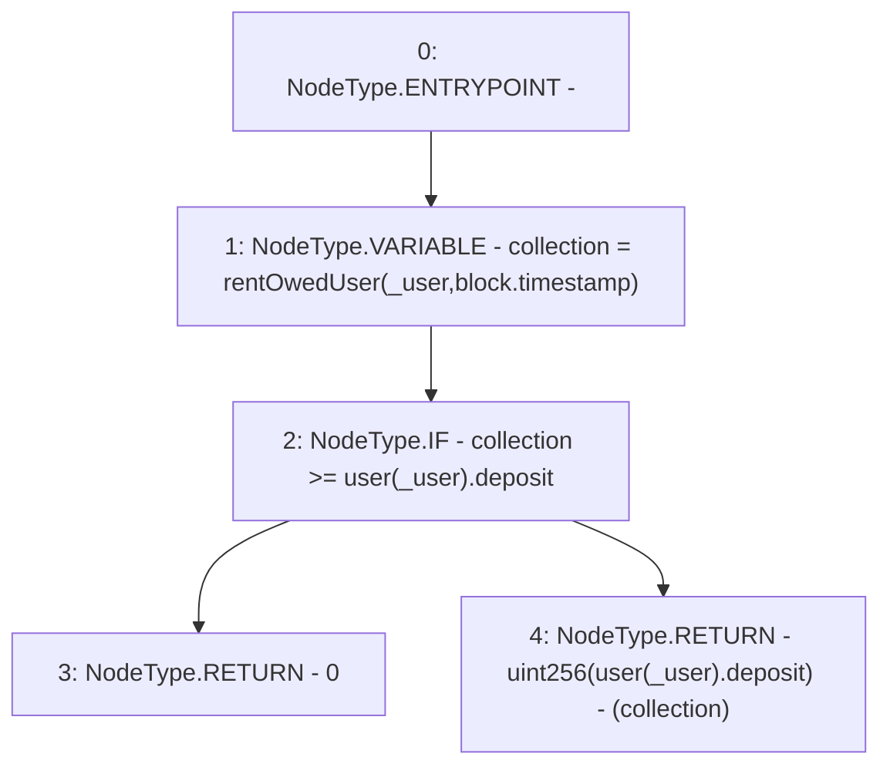

# Context: RCTreasury.depositAbleToWithdraw

**Contract:** `RCTreasury` (Inherits: IRCTreasury, NativeMetaTransaction, Ownable, Context)
**Signature:** `depositAbleToWithdraw(address) returns (uint256)`
**Method Selector ID:** `Internal (No Method ID)`
**Visibility:** `internal`
**Environment-Free:** `No (reads EVM state context)`
**Modifiers:** None

### State Variables Interaction
- **Reads:** user
- **Writes:** None

### Environment & Verification Flags
- **Uses Foundry Cheatcodes:** No
- **Has Echidna Properties:** No

### Internal Calls Tree
- None

### External Calls / Value Transfers
- None

### Control Flow Graph (CFG)


### Source Mapping
Declared in: `contracts/RCTreasury.sol` on lines **642** to **653**

```solidity
    function depositAbleToWithdraw(address _user)
        internal
        view
        returns (uint256)
    {
        uint256 collection = rentOwedUser(_user, block.timestamp);
        if (collection >= user[_user].deposit) {
            return 0;
        } else {
            return uint256(user[_user].deposit) - (collection);
        }
    }

```
