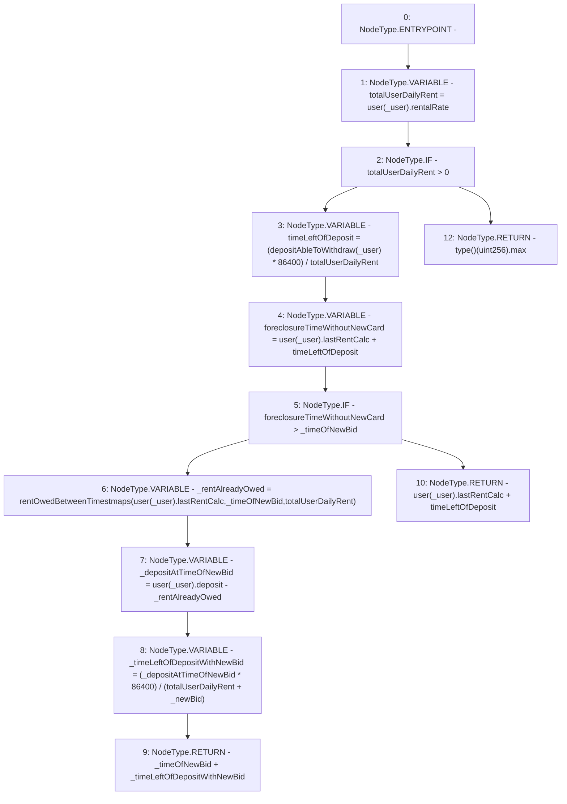

# Context: RCTreasury.foreclosureTimeUser

**Contract:** `RCTreasury` (Inherits: IRCTreasury, NativeMetaTransaction, Ownable, Context)
**Signature:** `foreclosureTimeUser(address,uint256,uint256) returns (uint256)`
**Method Selector ID:** `0x4a807724`
**Visibility:** `external`
**Environment-Free:** `No (reads EVM state context)`
**Modifiers:** None

### State Variables Interaction
- **Reads:** user
- **Writes:** None

### Environment & Verification Flags
- **Uses Foundry Cheatcodes:** No
- **Has Echidna Properties:** No

### Internal Calls Tree
- None

### External Calls / Value Transfers
- None

### Control Flow Graph (CFG)


### Source Mapping
Declared in: `contracts/RCTreasury.sol` on lines **659** to **695**

```solidity
    function foreclosureTimeUser(
        address _user,
        uint256 _newBid,
        uint256 _timeOfNewBid
    ) external view override returns (uint256) {
        uint256 totalUserDailyRent = user[_user].rentalRate;
        if (totalUserDailyRent > 0) {
            // timeLeftOfDeposit = deposit / (totalUserDailyRent / 1 day)
            //                   = (deposit * 1day) / totalUserDailyRent
            uint256 timeLeftOfDeposit =
                (depositAbleToWithdraw(_user) * 1 days) / totalUserDailyRent;

            uint256 foreclosureTimeWithoutNewCard =
                user[_user].lastRentCalc + timeLeftOfDeposit;

            if (foreclosureTimeWithoutNewCard > _timeOfNewBid) {
                // calculate how long they can own the new card for
                uint256 _rentAlreadyOwed =
                    rentOwedBetweenTimestmaps(
                        user[_user].lastRentCalc,
                        _timeOfNewBid,
                        totalUserDailyRent
                    );
                uint256 _depositAtTimeOfNewBid =
                    user[_user].deposit - _rentAlreadyOwed;
                uint256 _timeLeftOfDepositWithNewBid =
                    (_depositAtTimeOfNewBid * 1 days) /
                        (totalUserDailyRent + _newBid);
                return _timeOfNewBid + _timeLeftOfDepositWithNewBid;
            } else {
                return user[_user].lastRentCalc + timeLeftOfDeposit;
            }
        } else {
            // if no rentals they'll foreclose after the heat death of the universe
            return type(uint256).max;
        }
    }

```
