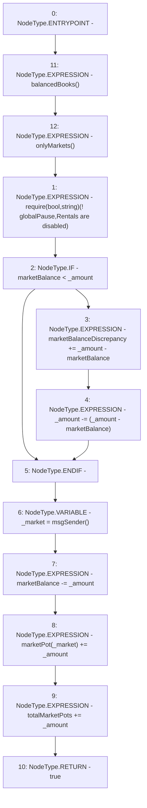

# Context: RCTreasury.payRent

**Contract:** `RCTreasury` (Inherits: IRCTreasury, NativeMetaTransaction, Ownable, Context)
**Signature:** `payRent(uint256) returns (bool)`
**Method Selector ID:** `0xd9e8843f`
**Visibility:** `external`
**Environment-Free:** `No (reads EVM state context)`
**Modifiers:**
- `balancedBooks`
  ```solidity
  modifier balancedBooks {
          _;
          // using >= not == in case anyone sends tokens direct to contract
          require(
              erc20.balanceOf(address(this)) >=
                  totalDeposits + marketBalance + totalMarketPots,
              "Books are unbalanced!"
          );
      }
  ```
- `onlyMarkets`
  ```solidity
  modifier onlyMarkets {
          require(isMarket[msgSender()], "Not authorised");
          _;
      }
  ```

### State Variables Interaction
- **Reads:** globalPause, marketBalance, marketBalanceDiscrepancy, marketPot, totalMarketPots
- **Writes:** marketBalance, marketBalanceDiscrepancy, marketPot, totalMarketPots

### Assertion Checks & Business Requirements
- require/assert: `require(bool,string)(! globalPause,Rentals are disabled)`

### Environment & Verification Flags
- **Uses Foundry Cheatcodes:** No
- **Has Echidna Properties:** No

### Internal Calls Tree
- None

### External Calls / Value Transfers
- None

### Control Flow Graph (CFG)


### Source Mapping
Declared in: `contracts/RCTreasury.sol` on lines **406** to **424**

```solidity
    function payRent(uint256 _amount)
        external
        override
        balancedBooks
        onlyMarkets
        returns (bool)
    {
        require(!globalPause, "Rentals are disabled");
        if (marketBalance < _amount) {
            marketBalanceDiscrepancy += _amount - marketBalance;
            _amount -= (_amount - marketBalance);
        }
        address _market = msgSender();
        marketBalance -= _amount;
        marketPot[_market] += _amount;
        totalMarketPots += _amount;

        return true;
    }

```
