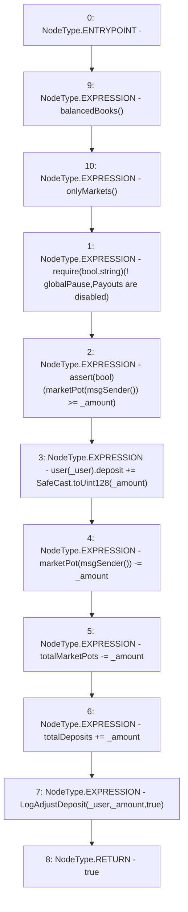

# Context: RCTreasury.payout

**Contract:** `RCTreasury` (Inherits: IRCTreasury, NativeMetaTransaction, Ownable, Context)
**Signature:** `payout(address,uint256) returns (bool)`
**Method Selector ID:** `0x117de2fd`
**Visibility:** `external`
**Environment-Free:** `No (reads EVM state context)`
**Modifiers:**
- `balancedBooks`
  ```solidity
  modifier balancedBooks {
          _;
          // using >= not == in case anyone sends tokens direct to contract
          require(
              erc20.balanceOf(address(this)) >=
                  totalDeposits + marketBalance + totalMarketPots,
              "Books are unbalanced!"
          );
      }
  ```
- `onlyMarkets`
  ```solidity
  modifier onlyMarkets {
          require(isMarket[msgSender()], "Not authorised");
          _;
      }
  ```

### State Variables Interaction
- **Reads:** globalPause, marketPot, totalDeposits, totalMarketPots, user
- **Writes:** marketPot, totalDeposits, totalMarketPots, user

### Assertion Checks & Business Requirements
- require/assert: `require(bool,string)(! globalPause,Payouts are disabled)`
- require/assert: `assert(bool)(marketPot[msgSender()] >= _amount)`

### Environment & Verification Flags
- **Uses Foundry Cheatcodes:** No
- **Has Echidna Properties:** No

### Internal Calls Tree
- None

### External Calls / Value Transfers
- `SafeCast.TMP_1662(uint128) = LIBRARY_CALL, dest:SafeCast, function:SafeCast.toUint128(uint256), arguments:['_amount'] `

### Control Flow Graph (CFG)


### Source Mapping
Declared in: `contracts/RCTreasury.sol` on lines **429** to **444**

```solidity
    function payout(address _user, uint256 _amount)
        external
        override
        balancedBooks
        onlyMarkets
        returns (bool)
    {
        require(!globalPause, "Payouts are disabled");
        assert(marketPot[msgSender()] >= _amount);
        user[_user].deposit += SafeCast.toUint128(_amount);
        marketPot[msgSender()] -= _amount;
        totalMarketPots -= _amount;
        totalDeposits += _amount;
        emit LogAdjustDeposit(_user, _amount, true);
        return true;
    }

```
