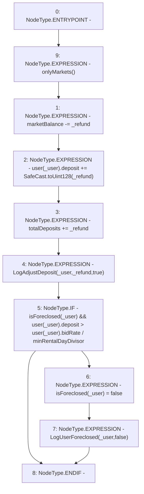

# Context: RCTreasury.refundUser

**Contract:** `RCTreasury` (Inherits: IRCTreasury, NativeMetaTransaction, Ownable, Context)
**Signature:** `refundUser(address,uint256)`
**Method Selector ID:** `0xeea758f1`
**Visibility:** `external`
**Environment-Free:** `No (reads EVM state context)`
**Modifiers:**
- `onlyMarkets`
  ```solidity
  modifier onlyMarkets {
          require(isMarket[msgSender()], "Not authorised");
          _;
      }
  ```

### State Variables Interaction
- **Reads:** isForeclosed, marketBalance, minRentalDayDivisor, totalDeposits, user
- **Writes:** isForeclosed, marketBalance, totalDeposits, user

### Environment & Verification Flags
- **Uses Foundry Cheatcodes:** No
- **Has Echidna Properties:** No

### Internal Calls Tree
- None

### External Calls / Value Transfers
- `SafeCast.TMP_1667(uint128) = LIBRARY_CALL, dest:SafeCast, function:SafeCast.toUint128(uint256), arguments:['_refund'] `

### Control Flow Graph (CFG)


### Source Mapping
Declared in: `contracts/RCTreasury.sol` on lines **447** to **463**

```solidity
    function refundUser(address _user, uint256 _refund)
        external
        override
        onlyMarkets
    {
        marketBalance -= _refund;
        user[_user].deposit += SafeCast.toUint128(_refund);
        totalDeposits += _refund;
        emit LogAdjustDeposit(_user, _refund, true);
        if (
            isForeclosed[_user] &&
            user[_user].deposit > user[_user].bidRate / minRentalDayDivisor
        ) {
            isForeclosed[_user] = false;
            emit LogUserForeclosed(_user, false);
        }
    }

```
