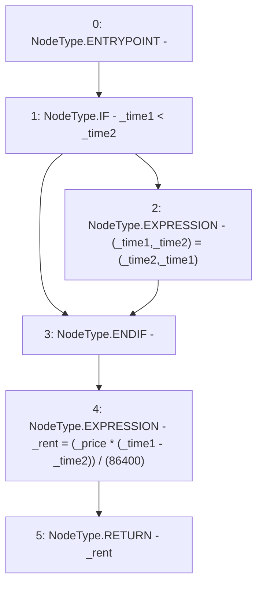

# Context: RCTreasury.rentOwedBetweenTimestmaps

**Contract:** `RCTreasury` (Inherits: IRCTreasury, NativeMetaTransaction, Ownable, Context)
**Signature:** `rentOwedBetweenTimestmaps(uint256,uint256,uint256) returns (uint256)`
**Method Selector ID:** `Internal (No Method ID)`
**Visibility:** `internal`
**Environment-Free:** `Yes`
**Modifiers:** None

### State Variables Interaction
- **Reads:** None
- **Writes:** None

### Environment & Verification Flags
- **Uses Foundry Cheatcodes:** No
- **Has Echidna Properties:** No

### Internal Calls Tree
- None

### External Calls / Value Transfers
- None

### Control Flow Graph (CFG)


### Source Mapping
Declared in: `contracts/RCTreasury.sol` on lines **628** to **637**

```solidity
    function rentOwedBetweenTimestmaps(
        uint256 _time1,
        uint256 _time2,
        uint256 _price
    ) internal pure returns (uint256 _rent) {
        if (_time1 < _time2) {
            (_time1, _time2) = (_time2, _time1);
        }
        _rent = (_price * (_time1 - _time2)) / (1 days);
    }

```
