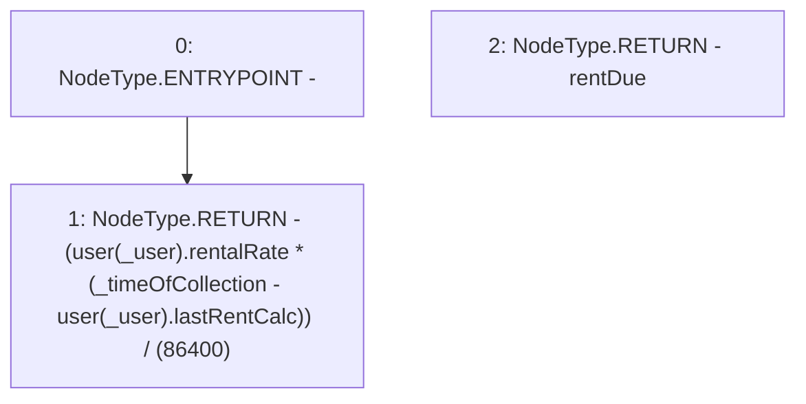

# Context: RCTreasury.rentOwedUser

**Contract:** `RCTreasury` (Inherits: IRCTreasury, NativeMetaTransaction, Ownable, Context)
**Signature:** `rentOwedUser(address,uint256) returns (uint256)`
**Method Selector ID:** `Internal (No Method ID)`
**Visibility:** `internal`
**Environment-Free:** `Yes`
**Modifiers:** None

### State Variables Interaction
- **Reads:** user
- **Writes:** None

### Environment & Verification Flags
- **Uses Foundry Cheatcodes:** No
- **Has Echidna Properties:** No

### Internal Calls Tree
- None

### External Calls / Value Transfers
- None

### Control Flow Graph (CFG)


### Source Mapping
Declared in: `contracts/RCTreasury.sol` on lines **612** to **620**

```solidity
    function rentOwedUser(address _user, uint256 _timeOfCollection)
        internal
        view
        returns (uint256 rentDue)
    {
        return
            (user[_user].rentalRate *
                (_timeOfCollection - user[_user].lastRentCalc)) / (1 days);
    }

```
