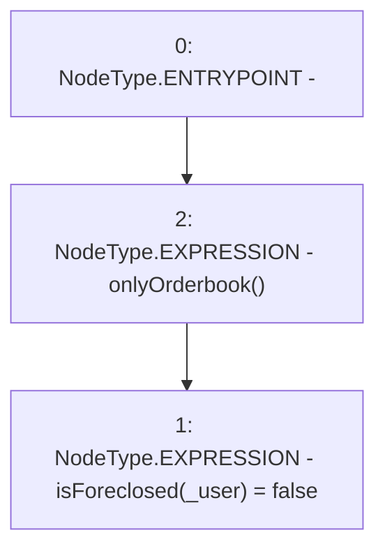

# Context: RCTreasury.resetUser

**Contract:** `RCTreasury` (Inherits: IRCTreasury, NativeMetaTransaction, Ownable, Context)
**Signature:** `resetUser(address)`
**Method Selector ID:** `0x343959b4`
**Visibility:** `external`
**Environment-Free:** `No (reads EVM state context)`
**Modifiers:**
- `onlyOrderbook`
  ```solidity
  modifier onlyOrderbook {
          require(msgSender() == address(orderbook), "Not authorised");
          _;
      }
  ```

### State Variables Interaction
- **Reads:** None
- **Writes:** isForeclosed

### Environment & Verification Flags
- **Uses Foundry Cheatcodes:** No
- **Has Echidna Properties:** No

### Internal Calls Tree
- None

### External Calls / Value Transfers
- None

### Control Flow Graph (CFG)


### Source Mapping
Declared in: `contracts/RCTreasury.sol` on lines **600** to **602**

```solidity
    function resetUser(address _user) external override onlyOrderbook {
        isForeclosed[_user] = false;
    }

```
