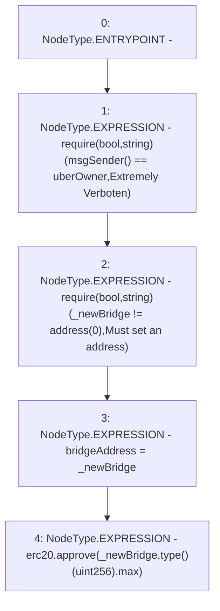

# Context: RCTreasury.setBridgeAddress

**Contract:** `RCTreasury` (Inherits: IRCTreasury, NativeMetaTransaction, Ownable, Context)
**Signature:** `setBridgeAddress(address)`
**Method Selector ID:** `0x7f5a22f9`
**Visibility:** `public`
**Environment-Free:** `No (reads EVM state context)`
**Modifiers:** None

### State Variables Interaction
- **Reads:** erc20, uberOwner
- **Writes:** bridgeAddress

### Assertion Checks & Business Requirements
- require/assert: `require(bool,string)(msgSender() == uberOwner,Extremely Verboten)`
- require/assert: `require(bool,string)(_newBridge != address(0),Must set an address)`

### Environment & Verification Flags
- **Uses Foundry Cheatcodes:** No
- **Has Echidna Properties:** No

### Internal Calls Tree
- None

### External Calls / Value Transfers
- `IERC20.TMP_1578(bool) = HIGH_LEVEL_CALL, dest:erc20(IERC20), function:approve, arguments:['_newBridge', 'TMP_1577']  `

### Control Flow Graph (CFG)


### Source Mapping
Declared in: `contracts/RCTreasury.sol` on lines **257** to **262**

```solidity
    function setBridgeAddress(address _newBridge) public override {
        require(msgSender() == uberOwner, "Extremely Verboten");
        require(_newBridge != address(0), "Must set an address");
        bridgeAddress = _newBridge;
        erc20.approve(_newBridge, type(uint256).max);
    }

```
