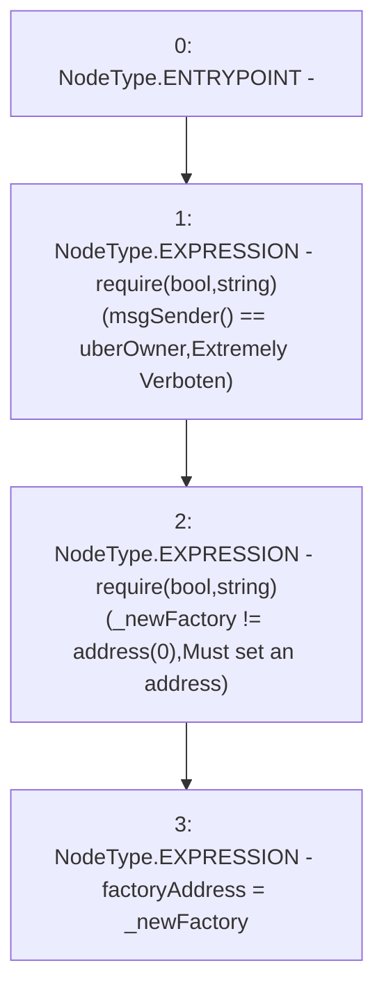

# Context: RCTreasury.setFactoryAddress

**Contract:** `RCTreasury` (Inherits: IRCTreasury, NativeMetaTransaction, Ownable, Context)
**Signature:** `setFactoryAddress(address)`
**Method Selector ID:** `0x83c17c55`
**Visibility:** `external`
**Environment-Free:** `No (reads EVM state context)`
**Modifiers:** None

### State Variables Interaction
- **Reads:** uberOwner
- **Writes:** factoryAddress

### Assertion Checks & Business Requirements
- require/assert: `require(bool,string)(msgSender() == uberOwner,Extremely Verboten)`
- require/assert: `require(bool,string)(_newFactory != address(0),Must set an address)`

### Environment & Verification Flags
- **Uses Foundry Cheatcodes:** No
- **Has Echidna Properties:** No

### Internal Calls Tree
- None

### External Calls / Value Transfers
- None

### Control Flow Graph (CFG)


### Source Mapping
Declared in: `contracts/RCTreasury.sol` on lines **233** to **237**

```solidity
    function setFactoryAddress(address _newFactory) external override {
        require(msgSender() == uberOwner, "Extremely Verboten");
        require(_newFactory != address(0), "Must set an address");
        factoryAddress = _newFactory;
    }

```
