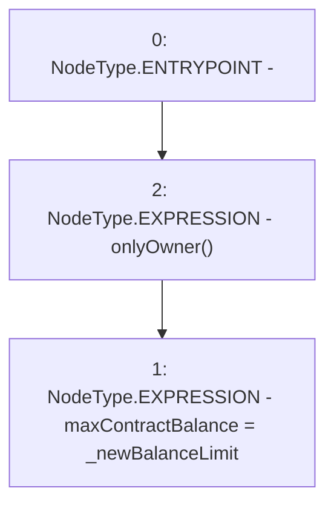

# Context: RCTreasury.setMaxContractBalance

**Contract:** `RCTreasury` (Inherits: IRCTreasury, NativeMetaTransaction, Ownable, Context)
**Signature:** `setMaxContractBalance(uint256)`
**Method Selector ID:** `0x3f4bf03c`
**Visibility:** `public`
**Environment-Free:** `No (reads EVM state context)`
**Modifiers:**
- `onlyOwner`
  ```solidity
  modifier onlyOwner() {
          require(owner() == _msgSender(), "Ownable: caller is not the owner");
          _;
      }
  ```

### State Variables Interaction
- **Reads:** None
- **Writes:** maxContractBalance

### Environment & Verification Flags
- **Uses Foundry Cheatcodes:** No
- **Has Echidna Properties:** No

### Internal Calls Tree
- None

### External Calls / Value Transfers
- None

### Control Flow Graph (CFG)


### Source Mapping
Declared in: `contracts/RCTreasury.sol` on lines **175** to **181**

```solidity
    function setMaxContractBalance(uint256 _newBalanceLimit)
        public
        override
        onlyOwner
    {
        maxContractBalance = _newBalanceLimit;
    }

```
