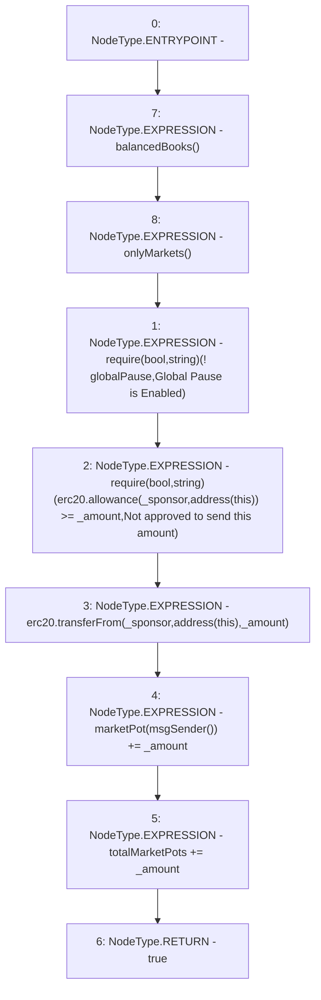

# Context: RCTreasury.sponsor

**Contract:** `RCTreasury` (Inherits: IRCTreasury, NativeMetaTransaction, Ownable, Context)
**Signature:** `sponsor(address,uint256) returns (bool)`
**Method Selector ID:** `0x8c995e44`
**Visibility:** `external`
**Environment-Free:** `No (reads EVM state context)`
**Modifiers:**
- `balancedBooks`
  ```solidity
  modifier balancedBooks {
          _;
          // using >= not == in case anyone sends tokens direct to contract
          require(
              erc20.balanceOf(address(this)) >=
                  totalDeposits + marketBalance + totalMarketPots,
              "Books are unbalanced!"
          );
      }
  ```
- `onlyMarkets`
  ```solidity
  modifier onlyMarkets {
          require(isMarket[msgSender()], "Not authorised");
          _;
      }
  ```

### State Variables Interaction
- **Reads:** erc20, globalPause, marketPot, totalMarketPots
- **Writes:** marketPot, totalMarketPots

### Assertion Checks & Business Requirements
- require/assert: `require(bool,string)(! globalPause,Global Pause is Enabled)`
- require/assert: `require(bool,string)(erc20.allowance(_sponsor,address(this)) >= _amount,Not approved to send this amount)`

### Environment & Verification Flags
- **Uses Foundry Cheatcodes:** No
- **Has Echidna Properties:** No

### Internal Calls Tree
- None

### External Calls / Value Transfers
- `TMP_1679(None) = SOLIDITY_CALL require(bool,string)(TMP_1678,Not approved to send this amount)`
- `IERC20.TMP_1677(uint256) = HIGH_LEVEL_CALL, dest:erc20(IERC20), function:allowance, arguments:['_sponsor', 'TMP_1676']  `
- `IERC20.TMP_1681(bool) = HIGH_LEVEL_CALL, dest:erc20(IERC20), function:transferFrom, arguments:['_sponsor', 'TMP_1680', '_amount']  `

### Control Flow Graph (CFG)


### Source Mapping
Declared in: `contracts/RCTreasury.sol` on lines **466** to **482**

```solidity
    function sponsor(address _sponsor, uint256 _amount)
        external
        override
        balancedBooks
        onlyMarkets
        returns (bool)
    {
        require(!globalPause, "Global Pause is Enabled");
        require(
            erc20.allowance(_sponsor, address(this)) >= _amount,
            "Not approved to send this amount"
        );
        erc20.transferFrom(_sponsor, address(this), _amount);
        marketPot[msgSender()] += _amount;
        totalMarketPots += _amount;
        return true;
    }

```
