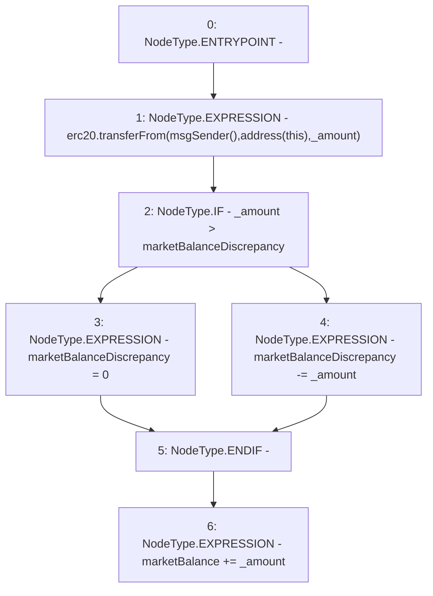

# Context: RCTreasury.topupMarketBalance

**Contract:** `RCTreasury` (Inherits: IRCTreasury, NativeMetaTransaction, Ownable, Context)
**Signature:** `topupMarketBalance(uint256)`
**Method Selector ID:** `0x20cba085`
**Visibility:** `external`
**Environment-Free:** `No (reads EVM state context)`
**Modifiers:** None

### State Variables Interaction
- **Reads:** erc20, marketBalance, marketBalanceDiscrepancy
- **Writes:** marketBalance, marketBalanceDiscrepancy

### Environment & Verification Flags
- **Uses Foundry Cheatcodes:** No
- **Has Echidna Properties:** No

### Internal Calls Tree
- None

### External Calls / Value Transfers
- `IERC20.TMP_1640(bool) = HIGH_LEVEL_CALL, dest:erc20(IERC20), function:transferFrom, arguments:['TMP_1638', 'TMP_1639', '_amount']  `

### Control Flow Graph (CFG)


### Source Mapping
Declared in: `contracts/RCTreasury.sol` on lines **372** to **380**

```solidity
    function topupMarketBalance(uint256 _amount) external override {
        erc20.transferFrom(msgSender(), address(this), _amount);
        if (_amount > marketBalanceDiscrepancy) {
            marketBalanceDiscrepancy = 0;
        } else {
            marketBalanceDiscrepancy -= _amount;
        }
        marketBalance += _amount;
    }

```
