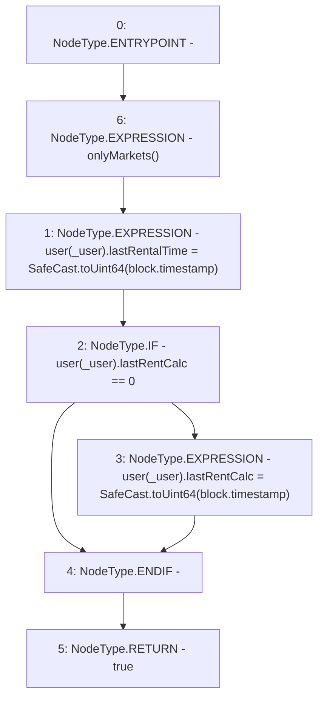

# Context: RCTreasury.updateLastRentalTime

**Contract:** `RCTreasury` (Inherits: IRCTreasury, NativeMetaTransaction, Ownable, Context)
**Signature:** `updateLastRentalTime(address) returns (bool)`
**Method Selector ID:** `0xeb358a20`
**Visibility:** `external`
**Environment-Free:** `No (reads EVM state context)`
**Modifiers:**
- `onlyMarkets`
  ```solidity
  modifier onlyMarkets {
          require(isMarket[msgSender()], "Not authorised");
          _;
      }
  ```

### State Variables Interaction
- **Reads:** user
- **Writes:** user

### Environment & Verification Flags
- **Uses Foundry Cheatcodes:** No
- **Has Echidna Properties:** No

### Internal Calls Tree
- None

### External Calls / Value Transfers
- `SafeCast.TMP_1685(uint64) = LIBRARY_CALL, dest:SafeCast, function:SafeCast.toUint64(uint256), arguments:['block.timestamp'] `
- `SafeCast.TMP_1687(uint64) = LIBRARY_CALL, dest:SafeCast, function:SafeCast.toUint64(uint256), arguments:['block.timestamp'] `

### Control Flow Graph (CFG)


### Source Mapping
Declared in: `contracts/RCTreasury.sol` on lines **487** to **498**

```solidity
    function updateLastRentalTime(address _user)
        external
        override
        onlyMarkets
        returns (bool)
    {
        user[_user].lastRentalTime = SafeCast.toUint64(block.timestamp);
        if (user[_user].lastRentCalc == 0) {
            user[_user].lastRentCalc = SafeCast.toUint64(block.timestamp);
        }
        return true;
    }

```
