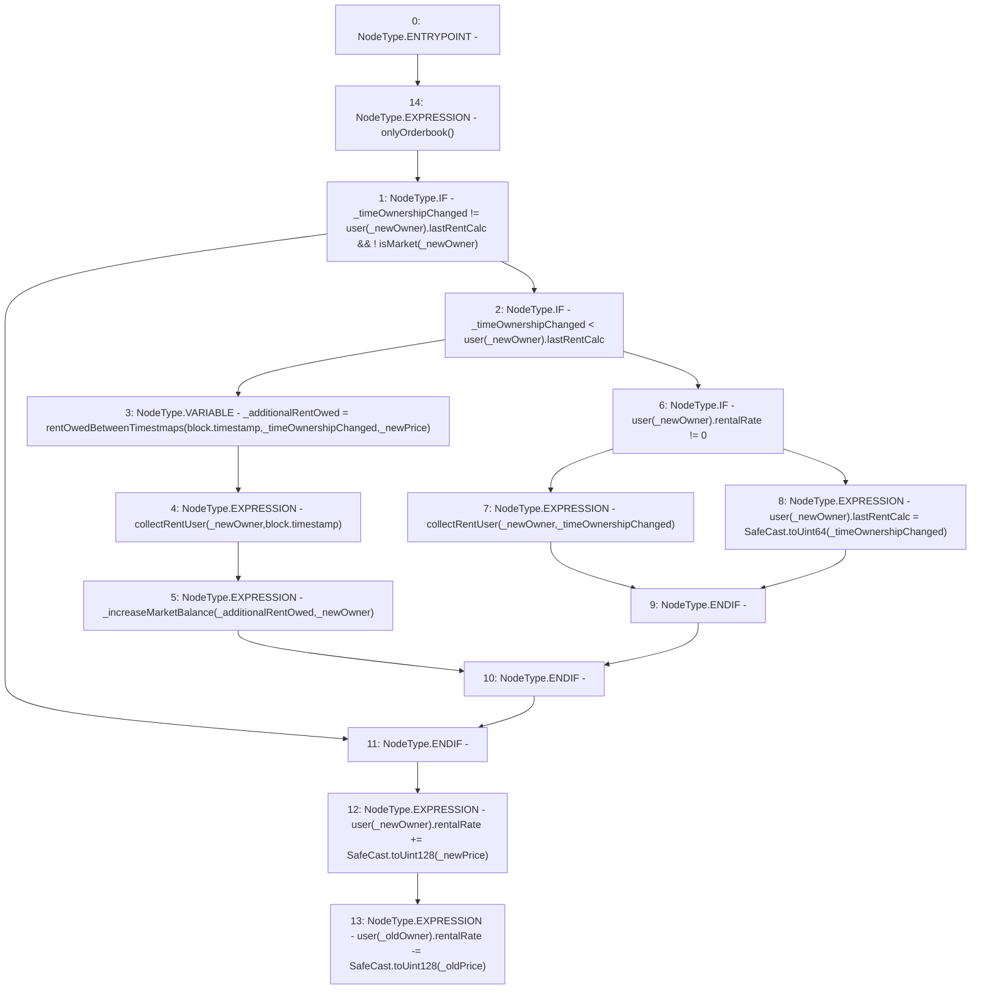

# Context: RCTreasury.updateRentalRate

**Contract:** `RCTreasury` (Inherits: IRCTreasury, NativeMetaTransaction, Ownable, Context)
**Signature:** `updateRentalRate(address,address,uint256,uint256,uint256)`
**Method Selector ID:** `0xfe8f9dc2`
**Visibility:** `external`
**Environment-Free:** `No (reads EVM state context)`
**Modifiers:**
- `onlyOrderbook`
  ```solidity
  modifier onlyOrderbook {
          require(msgSender() == address(orderbook), "Not authorised");
          _;
      }
  ```

### State Variables Interaction
- **Reads:** isMarket, user
- **Writes:** user

### Environment & Verification Flags
- **Uses Foundry Cheatcodes:** No
- **Has Echidna Properties:** No

### Internal Calls Tree
- None

### External Calls / Value Transfers
- `SafeCast.TMP_1701(uint128) = LIBRARY_CALL, dest:SafeCast, function:SafeCast.toUint128(uint256), arguments:['_oldPrice'] `
- `SafeCast.TMP_1699(uint64) = LIBRARY_CALL, dest:SafeCast, function:SafeCast.toUint64(uint256), arguments:['_timeOwnershipChanged'] `
- `SafeCast.TMP_1700(uint128) = LIBRARY_CALL, dest:SafeCast, function:SafeCast.toUint128(uint256), arguments:['_newPrice'] `

### Control Flow Graph (CFG)


### Source Mapping
Declared in: `contracts/RCTreasury.sol` on lines **537** to **579**

```solidity
    function updateRentalRate(
        address _oldOwner,
        address _newOwner,
        uint256 _oldPrice,
        uint256 _newPrice,
        uint256 _timeOwnershipChanged
    ) external override onlyOrderbook {
        if (
            _timeOwnershipChanged != user[_newOwner].lastRentCalc &&
            !isMarket[_newOwner]
        ) {
            // The new owners rent must be collected before adjusting their rentalRate
            // See if the new owner has had a rent collection before or after this ownership change
            if (_timeOwnershipChanged < user[_newOwner].lastRentCalc) {
                // the new owner has a more recent rent collection

                uint256 _additionalRentOwed =
                    rentOwedBetweenTimestmaps(
                        block.timestamp,
                        _timeOwnershipChanged,
                        _newPrice
                    );
                collectRentUser(_newOwner, block.timestamp);

                // they have enough funds, just collect the extra
                _increaseMarketBalance(_additionalRentOwed, _newOwner);
            } else {
                // the new owner has an old rent collection, do they own anything else?
                if (user[_newOwner].rentalRate != 0) {
                    // rent collect upto ownership change time
                    collectRentUser(_newOwner, _timeOwnershipChanged);
                } else {
                    // first card owned, set start time
                    user[_newOwner].lastRentCalc = SafeCast.toUint64(
                        _timeOwnershipChanged
                    );
                }
            }
        }
        // Must add before subtract, to avoid underflow in the case a user is only updating their price.
        user[_newOwner].rentalRate += SafeCast.toUint128(_newPrice);
        user[_oldOwner].rentalRate -= SafeCast.toUint128(_oldPrice);
    }

```
