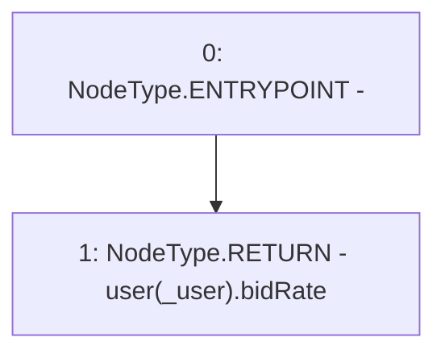

# Context: RCTreasury.userTotalBids

**Contract:** `RCTreasury` (Inherits: IRCTreasury, NativeMetaTransaction, Ownable, Context)
**Signature:** `userTotalBids(address) returns (uint256)`
**Method Selector ID:** `0xb165d0f2`
**Visibility:** `external`
**Environment-Free:** `Yes`
**Modifiers:** None

### State Variables Interaction
- **Reads:** user
- **Writes:** None

### Environment & Verification Flags
- **Uses Foundry Cheatcodes:** No
- **Has Echidna Properties:** No

### Internal Calls Tree
- None

### External Calls / Value Transfers
- None

### Control Flow Graph (CFG)


### Source Mapping
Declared in: `contracts/RCTreasury.sol` on lines **506** to **513**

```solidity
    function userTotalBids(address _user)
        external
        view
        override
        returns (uint256)
    {
        return user[_user].bidRate;
    }

```
