# Context: RCTreasury.withdrawDeposit

**Contract:** `RCTreasury` (Inherits: IRCTreasury, NativeMetaTransaction, Ownable, Context)
**Signature:** `withdrawDeposit(uint256,bool)`
**Method Selector ID:** `0xe7d8e97f`
**Visibility:** `external`
**Environment-Free:** `No (reads EVM state context)`
**Modifiers:**
- `balancedBooks`
  ```solidity
  modifier balancedBooks {
          _;
          // using >= not == in case anyone sends tokens direct to contract
          require(
              erc20.balanceOf(address(this)) >=
                  totalDeposits + marketBalance + totalMarketPots,
              "Books are unbalanced!"
          );
      }
  ```

### State Variables Interaction
- **Reads:** bridgeAddress, erc20, globalPause, isForeclosed, minRentalDayDivisor, orderbook, totalDeposits, user
- **Writes:** isForeclosed, totalDeposits, user

### Assertion Checks & Business Requirements
- require/assert: `require(bool,string)(! globalPause,Withdrawals are disabled)`
- require/assert: `require(bool,string)(user[_msgSender].deposit > 0,Nothing to withdraw)`
- require/assert: `require(bool,string)(user[_msgSender].bidRate == 0 || block.timestamp - (user[_msgSender].lastRentalTime) > uint256(86400) / minRentalDayDivisor,Too soon)`

### Environment & Verification Flags
- **Uses Foundry Cheatcodes:** No
- **Has Echidna Properties:** No

### Internal Calls Tree
- None

### External Calls / Value Transfers
- `IRCOrderbook.TMP_1635(bool) = HIGH_LEVEL_CALL, dest:orderbook(IRCOrderbook), function:removeUserFromOrderbook, arguments:['_msgSender']  `
- `SafeCast.TMP_1627(uint128) = LIBRARY_CALL, dest:SafeCast, function:SafeCast.toUint128(uint256), arguments:['_amount'] `
- `IRCBridge.HIGH_LEVEL_CALL, dest:bridge(IRCBridge), function:withdrawToMainnet, arguments:['_msgSender', '_amount']  `
- `IERC20.TMP_1628(bool) = HIGH_LEVEL_CALL, dest:erc20(IERC20), function:transfer, arguments:['_msgSender', '_amount']  `

### Control Flow Graph (CFG)

```mermaid
flowchart TD
    Node_0["0: NodeType.ENTRYPOINT - "]
    Node_0 --> Node_22
    Node_1["1: NodeType.EXPRESSION - require(bool,string)(! globalPause,Withdrawals are disabled)"]
    Node_1 --> Node_2
    Node_2["2: NodeType.VARIABLE - _msgSender = msgSender()"]
    Node_2 --> Node_3
    Node_3["3: NodeType.EXPRESSION - require(bool,string)(user(_msgSender).deposit > 0,Nothing to withdraw)"]
    Node_3 --> Node_4
    Node_4["4: NodeType.EXPRESSION - require(bool,string)(user(_msgSender).bidRate == 0 || block.timestamp - (user(_msgSender).lastRentalTime) > uint256(86400) / minRentalDayDivisor,Too soon)"]
    Node_4 --> Node_5
    Node_5["5: NodeType.EXPRESSION - collectRentUser(_msgSender,block.timestamp)"]
    Node_5 --> Node_6
    Node_6["6: NodeType.IF - _amount > user(_msgSender).deposit"]
    Node_6 --> Node_7
    Node_6 --> Node_8
    Node_7["7: NodeType.EXPRESSION - _amount = user(_msgSender).deposit"]
    Node_7 --> Node_8
    Node_8["8: NodeType.ENDIF - "]
    Node_8 --> Node_9
    Node_9["9: NodeType.EXPRESSION - LogAdjustDeposit(_msgSender,_amount,false)"]
    Node_9 --> Node_10
    Node_10["10: NodeType.EXPRESSION - user(_msgSender).deposit -= SafeCast.toUint128(_amount)"]
    Node_10 --> Node_11
    Node_11["11: NodeType.EXPRESSION - totalDeposits -= _amount"]
    Node_11 --> Node_12
    Node_12["12: NodeType.IF - _localWithdrawal"]
    Node_12 --> Node_13
    Node_12 --> Node_14
    Node_13["13: NodeType.EXPRESSION - erc20.transfer(_msgSender,_amount)"]
    Node_13 --> Node_16
    Node_14["14: NodeType.VARIABLE - bridge = IRCBridge(bridgeAddress)"]
    Node_14 --> Node_15
    Node_15["15: NodeType.EXPRESSION - bridge.withdrawToMainnet(_msgSender,_amount)"]
    Node_15 --> Node_16
    Node_16["16: NodeType.ENDIF - "]
    Node_16 --> Node_17
    Node_17["17: NodeType.IF - user(_msgSender).bidRate != 0 && user(_msgSender).bidRate / (minRentalDayDivisor) > user(_msgSender).deposit"]
    Node_17 --> Node_18
    Node_17 --> Node_21
    Node_18["18: NodeType.EXPRESSION - isForeclosed(_msgSender) = true"]
    Node_18 --> Node_19
    Node_19["19: NodeType.EXPRESSION - isForeclosed(_msgSender) = orderbook.removeUserFromOrderbook(_msgSender)"]
    Node_19 --> Node_20
    Node_20["20: NodeType.EXPRESSION - LogUserForeclosed(_msgSender,isForeclosed(_msgSender))"]
    Node_20 --> Node_21
    Node_21["21: NodeType.ENDIF - "]
    Node_22["22: NodeType.EXPRESSION - balancedBooks()"]
    Node_22 --> Node_1
```


### Source Mapping
Declared in: `contracts/RCTreasury.sol` on lines **322** to **368**

```solidity
    function withdrawDeposit(uint256 _amount, bool _localWithdrawal)
        external
        override
        balancedBooks
    {
        require(!globalPause, "Withdrawals are disabled");
        address _msgSender = msgSender();
        require(user[_msgSender].deposit > 0, "Nothing to withdraw");
        // only allow withdraw if they have no bids,
        // OR they've had their cards for at least the minimum rental period
        require(
            user[_msgSender].bidRate == 0 ||
                block.timestamp - (user[_msgSender].lastRentalTime) >
                uint256(1 days) / minRentalDayDivisor,
            "Too soon"
        );

        // stpe 1: collect rent on owned cards
        collectRentUser(_msgSender, block.timestamp);

        // step 2: process withdrawal
        if (_amount > user[_msgSender].deposit) {
            _amount = user[_msgSender].deposit;
        }
        emit LogAdjustDeposit(_msgSender, _amount, false);
        user[_msgSender].deposit -= SafeCast.toUint128(_amount);
        totalDeposits -= _amount;
        if (_localWithdrawal) {
            erc20.transfer(_msgSender, _amount);
        } else {
            IRCBridge bridge = IRCBridge(bridgeAddress);
            bridge.withdrawToMainnet(_msgSender, _amount);
        }

        // step 3: remove bids if insufficient deposit
        if (
            user[_msgSender].bidRate != 0 &&
            user[_msgSender].bidRate / (minRentalDayDivisor) >
            user[_msgSender].deposit
        ) {
            isForeclosed[_msgSender] = true;
            isForeclosed[_msgSender] = orderbook.removeUserFromOrderbook(
                _msgSender
            );
            emit LogUserForeclosed(_msgSender, isForeclosed[_msgSender]);
        }
    }

```
