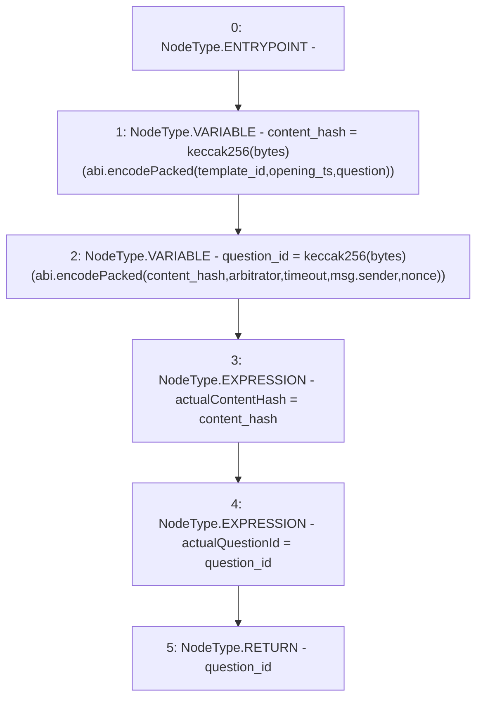

# Context: RealitioMockup.askQuestion

**Contract:** `RealitioMockup` (Inherits: None)
**Signature:** `askQuestion(uint256,string,address,uint32,uint32,uint256) returns (bytes32)`
**Method Selector ID:** `0x762c38fd`
**Visibility:** `external`
**Environment-Free:** `No (reads EVM state context)`
**Modifiers:** None

### State Variables Interaction
- **Reads:** None
- **Writes:** actualContentHash, actualQuestionId

### Environment & Verification Flags
- **Uses Foundry Cheatcodes:** No
- **Has Echidna Properties:** No

### Internal Calls Tree
- None

### External Calls / Value Transfers
- `TMP_1782(bytes) = SOLIDITY_CALL abi.encodePacked()(content_hash,arbitrator,timeout,msg.sender,nonce)`

### Control Flow Graph (CFG)


### Source Mapping
Declared in: `contracts/mockups/RealitioMockup.sol` on lines **21** to **44**

```solidity
    function askQuestion(
        uint256 template_id,
        string calldata question,
        address arbitrator,
        uint32 timeout,
        uint32 opening_ts,
        uint256 nonce
    ) external payable returns (bytes32) {
        bytes32 content_hash =
            keccak256(abi.encodePacked(template_id, opening_ts, question));
        bytes32 question_id =
            keccak256(
                abi.encodePacked(
                    content_hash,
                    arbitrator,
                    timeout,
                    msg.sender,
                    nonce
                )
            );
        actualContentHash = content_hash;
        actualQuestionId = question_id;
        return question_id;
    }

```
