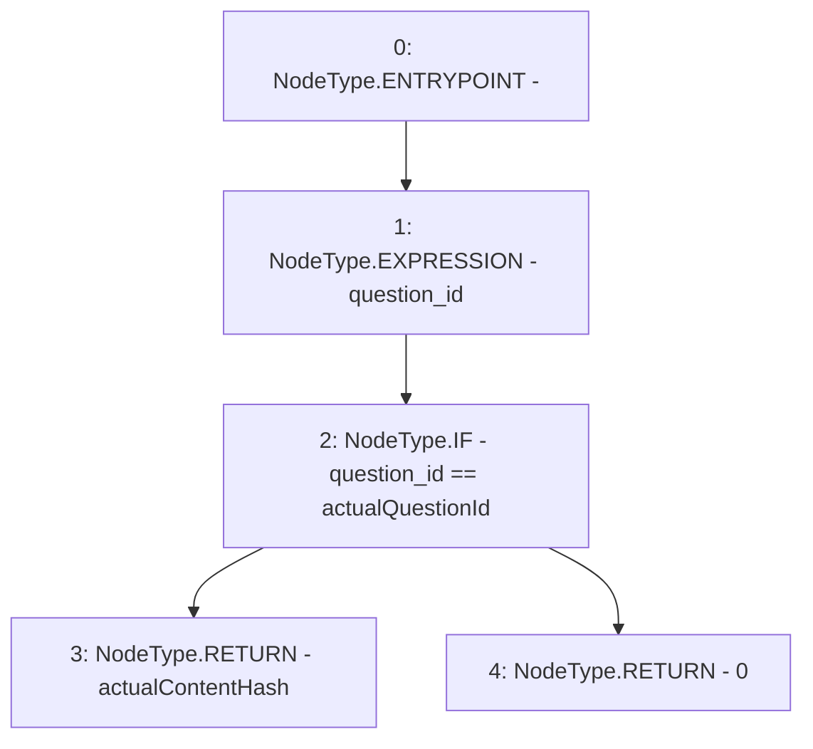

# Context: RealitioMockup.getContentHash

**Contract:** `RealitioMockup` (Inherits: None)
**Signature:** `getContentHash(bytes32) returns (bytes32)`
**Method Selector ID:** `0x51577ea9`
**Visibility:** `external`
**Environment-Free:** `Yes`
**Modifiers:** None

### State Variables Interaction
- **Reads:** actualContentHash, actualQuestionId
- **Writes:** None

### Environment & Verification Flags
- **Uses Foundry Cheatcodes:** No
- **Has Echidna Properties:** No

### Internal Calls Tree
- None

### External Calls / Value Transfers
- None

### Control Flow Graph (CFG)


### Source Mapping
Declared in: `contracts/mockups/RealitioMockup.sol` on lines **65** to **77**

```solidity
    function getContentHash(bytes32 question_id)
        external
        view
        returns (bytes32)
    {
        // console.logBytes32(bytes32 b);
        question_id;
        if (question_id == actualQuestionId) {
            return actualContentHash;
        } else {
            return 0;
        }
    }

```
